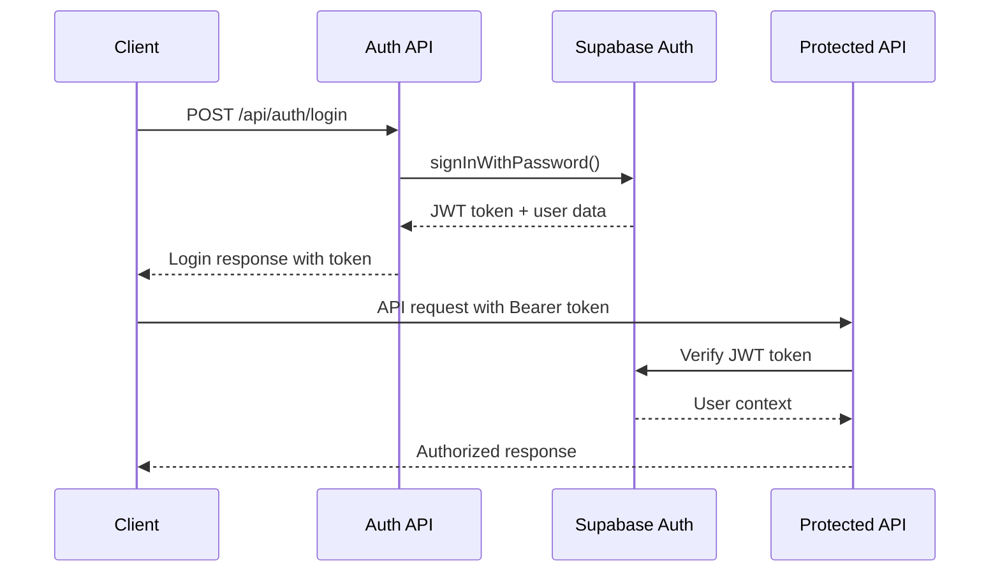
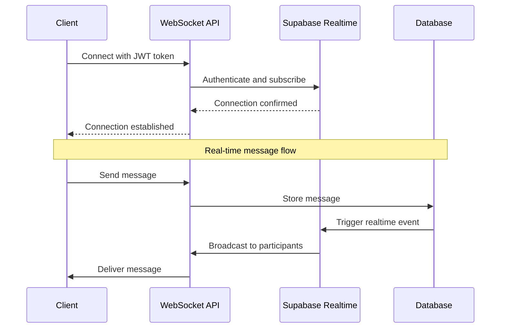

# API Specifications - BanaYeni SanaEski

**Document Type:** Complete API Reference and Specifications  
**Created:** August 6, 2025  
**Version:** 1.0  
**Status:** Final API Design  

---

## API Overview

The BanaYeni SanaEski API is designed as a RESTful service with WebSocket support, optimized for the Turkish automotive parts marketplace. The API emphasizes Turkish language support, mobile optimization, and the interest-gated communication business logic.

**API Characteristics:**
- **REST Design:** Standard HTTP methods with JSON responses
- **Turkish Optimization:** Error messages, validation, and content in Turkish
- **WebSocket Integration:** Real-time messaging capabilities
- **Mobile-First:** Optimized for Turkish mobile network conditions
- **Interest-Gating:** Business logic enforcement at API level
- **Supabase Integration:** Unified authentication and data access

**Base URLs:**
- **Production:** `https://banayeni-sanaeski.com/api`
- **Staging:** `https://banayeni-sanaeski-git-develop.vercel.app/api`
- **Development:** `http://localhost:3000/api`

---

## Authentication

### Authentication Method
**Type:** Bearer Token (JWT from Supabase Auth)  
**Header:** `Authorization: Bearer <jwt_token>`

### Authentication Flow



### Authentication Endpoints

#### POST /api/auth/login
**Purpose:** User authentication with email and password

**Request:**
```typescript
interface LoginRequest {
  email: string;
  password: string;
}
```

**Response:**
```typescript
interface LoginResponse {
  success: boolean;
  user: {
    id: string;
    email: string;
  };
  message: string; // Turkish success message
}
```

**Example:**
```bash
curl -X POST https://banayeni-sanaeski.com/api/auth/login \
  -H "Content-Type: application/json" \
  -d '{
    "email": "kullanici@example.com",
    "password": "güvenli_şifre123"
  }'
```

**Response:**
```json
{
  "success": true,
  "user": {
    "id": "123e4567-e89b-12d3-a456-426614174000",
    "email": "kullanici@example.com"
  },
  "message": "Başarıyla giriş yapıldı"
}
```

#### POST /api/auth/register
**Purpose:** New user registration

**Request:**
```typescript
interface RegisterRequest {
  email: string;
  password: string;
}
```

**Response:**
```typescript
interface RegisterResponse {
  success: boolean;
  message: string; // Turkish message
  requiresVerification?: boolean;
}
```

#### POST /api/auth/logout
**Purpose:** User logout and session termination

**Response:**
```typescript
interface LogoutResponse {
  success: boolean;
  message: string; // "Başarıyla çıkış yapıldı"
}
```

---

## Parts Management API

### GET /api/parts
**Purpose:** Search and filter parts with Turkish text optimization

**Query Parameters:**
```typescript
interface SearchParams {
  search?: string;           // General search query
  part_reference?: string;   // Specific part reference number
  condition?: 'Kullanılabilir' | 'Arızalı';
  brand?: string;           // Vehicle brand
  model?: string;           // Vehicle model
  location_city?: string;   // Turkish city name
  min_price?: number;       // Minimum price in TRY
  max_price?: number;       // Maximum price in TRY
  year_min?: number;        // Minimum year
  year_max?: number;        // Maximum year
  limit?: number;           // Results per page (default: 20)
  offset?: number;          // Pagination offset (default: 0)
}
```

**Response:**
```typescript
interface SearchPartsResponse {
  success: boolean;
  data: {
    parts: Part[];
    pagination: {
      total: number;
      limit: number;
      offset: number;
      has_more: boolean;
    };
    search_info: {
      query: string;
      execution_time_ms: number;
      total_results: number;
    };
  };
  message?: string;
}
```

**Example Request:**
```bash
curl -X GET "https://banayeni-sanaeski.com/api/parts?search=BMW+alternatör&condition=Kullanılabilir&location_city=İstanbul&limit=10"
```

**Example Response:**
```json
{
  "success": true,
  "data": {
    "parts": [
      {
        "id": "123e4567-e89b-12d3-a456-426614174000",
        "seller_id": "987fcdeb-51a2-43d1-9c4b-426614174111",
        "title": "BMW E46 Alternatör - Orijinal Bosch",
        "part_reference": "12317501999",
        "condition": "Kullanılabilir",
        "price": 850.00,
        "location_city": "İstanbul",
        "brand": "BMW",
        "model": "E46",
        "year": 2003,
        "description": "Orijinal Bosch alternatör, 2 yıl garanti",
        "images": [
          "https://supabase-storage-url/part-images/123/image1.jpg",
          "https://supabase-storage-url/part-images/123/image2.jpg"
        ],
        "status": "active",
        "created_at": "2024-08-01T10:30:00Z",
        "updated_at": "2024-08-01T10:30:00Z"
      }
    ],
    "pagination": {
      "total": 45,
      "limit": 10,
      "offset": 0,
      "has_more": true
    },
    "search_info": {
      "query": "BMW alternatör",
      "execution_time_ms": 127,
      "total_results": 45
    }
  }
}
```

### POST /api/parts
**Purpose:** Create new part listing (authenticated users only)

**Request:**
```typescript
interface CreatePartRequest {
  title: string;            // Min 5, max 200 characters
  part_reference: string;   // Min 3 characters, critical field
  condition: 'Kullanılabilir' | 'Arızalı';
  price: number;           // Positive number, max 999999.99
  location_city: string;   // Turkish city name
  brand: string;           // Vehicle/machine brand
  model: string;           // Specific model
  year: number;            // 1900-2030 range
  description?: string;    // Optional description
  images: string[];        // Array of base64 encoded images or URLs
}
```

**Response:**
```typescript
interface CreatePartResponse {
  success: boolean;
  data: {
    part: Part;
    upload_results?: {
      uploaded_images: string[];
      failed_uploads: string[];
    };
  };
  message: string; // Turkish success message
}
```

**Example Request:**
```bash
curl -X POST https://banayeni-sanaeski.com/api/parts \
  -H "Authorization: Bearer <jwt_token>" \
  -H "Content-Type: application/json" \
  -d '{
    "title": "Mercedes W203 Fren Diski",
    "part_reference": "A2034230612",
    "condition": "Kullanılabilir", 
    "price": 450.00,
    "location_city": "Ankara",
    "brand": "Mercedes",
    "model": "W203",
    "year": 2005,
    "description": "Orijinal Mercedes fren diski, hiç kullanılmamış",
    "images": ["base64_encoded_image_1", "base64_encoded_image_2"]
  }'
```

### GET /api/parts/[id]
**Purpose:** Get specific part details

**Path Parameters:**
- `id`: Part UUID

**Response:**
```typescript
interface PartDetailsResponse {
  success: boolean;
  data: {
    part: Part;
    seller_info: {
      id: string;
      email: string; // Masked for privacy: "k****@example.com"
    };
    similar_parts?: Part[]; // Optional similar parts
    user_can_express_interest: boolean;
    user_already_interested?: 'interested' | 'not_interested';
  };
}
```

### PUT /api/parts/[id]
**Purpose:** Update part listing (seller only)

**Authentication:** Required (seller must own the part)

**Request:** Same as `CreatePartRequest` but all fields optional

**Response:**
```typescript
interface UpdatePartResponse {
  success: boolean;
  data: {
    part: Part;
  };
  message: string; // "Parça güncellendi"
}
```

---

## Interest Management API

### POST /api/parts/[id]/interest
**Purpose:** Express interest in a specific part (core business logic)

**Authentication:** Required

**Path Parameters:**
- `id`: Part UUID

**Request:**
```typescript
interface ExpressInterestRequest {
  type: 'interested' | 'not_interested';
}
```

**Response:**
```typescript
interface ExpressInterestResponse {
  success: boolean;
  data: {
    interest: {
      id: string;
      type: 'interested' | 'not_interested';
      conversation_id?: string; // Present if type is 'interested'
    };
  };
  message: string; // Turkish message based on interest type
}
```

**Business Logic Flow:**
1. Validate user is not the seller
2. Check for existing interest (one per user per part)
3. If 'interested': Create conversation automatically
4. If 'not_interested': Mark for exclusion from future searches
5. Return appropriate Turkish message

**Example Request:**
```bash
curl -X POST https://banayeni-sanaeski.com/api/parts/123e4567-e89b-12d3-a456-426614174000/interest \
  -H "Authorization: Bearer <jwt_token>" \
  -H "Content-Type: application/json" \
  -d '{"type": "interested"}'
```

**Example Response (Interested):**
```json
{
  "success": true,
  "data": {
    "interest": {
      "id": "456e7890-e89b-12d3-a456-426614174111",
      "type": "interested",
      "conversation_id": "789e1234-e89b-12d3-a456-426614174222"
    }
  },
  "message": "İlginiz kaydedildi! Satıcı ile sohbet başlatabilirsiniz."
}
```

**Example Response (Not Interested):**
```json
{
  "success": true,
  "data": {
    "interest": {
      "id": "456e7890-e89b-12d3-a456-426614174111", 
      "type": "not_interested"
    }
  },
  "message": "Bu parça bir daha gösterilmeyecek."
}
```

**Error Responses:**
```json
{
  "success": false,
  "error": {
    "code": "PART_NOT_FOUND",
    "message": "Parça bulunamadı",
    "timestamp": "2024-08-06T14:30:00Z",
    "request_id": "req_123456789"
  }
}
```

```json
{
  "success": false,
  "error": {
    "code": "OWN_PART_INTEREST",
    "message": "Kendi parçanıza ilgi bildiremezsiniz",
    "timestamp": "2024-08-06T14:30:00Z", 
    "request_id": "req_123456790"
  }
}
```

```json
{
  "success": false,
  "error": {
    "code": "INTEREST_EXISTS",
    "message": "Bu parça için zaten ilgi bildirdiniz",
    "details": {
      "existing_type": "interested",
      "conversation_id": "789e1234-e89b-12d3-a456-426614174222"
    },
    "timestamp": "2024-08-06T14:30:00Z",
    "request_id": "req_123456791"
  }
}
```

### GET /api/interests
**Purpose:** Get user's interest history

**Authentication:** Required

**Query Parameters:**
- `type?: 'interested' | 'not_interested'` - Filter by interest type
- `limit?: number` - Default 20
- `offset?: number` - Default 0

**Response:**
```typescript
interface UserInterestsResponse {
  success: boolean;
  data: {
    interests: Array<{
      id: string;
      type: 'interested' | 'not_interested';
      part: Part;
      conversation_id?: string;
      created_at: string;
    }>;
    pagination: PaginationInfo;
  };
}
```

---

## Conversation and Messaging API

### GET /api/conversations
**Purpose:** Get user's conversations (both as buyer and seller)

**Authentication:** Required

**Query Parameters:**
- `status?: 'active' | 'closed'` - Filter by status
- `limit?: number` - Default 20
- `offset?: number` - Default 0

**Response:**
```typescript
interface ConversationsResponse {
  success: boolean;
  data: {
    conversations: Array<{
      id: string;
      buyer_id: string;
      seller_id: string;
      part: {
        id: string;
        title: string;
        part_reference: string;
        condition: string;
        price: number;
        images: string[];
      };
      other_user: {
        id: string;
        email: string; // Masked
      };
      status: 'active' | 'closed';
      last_message_at: string;
      unread_count: number;
      user_role: 'buyer' | 'seller'; // Current user's role
    }>;
    pagination: PaginationInfo;
  };
}
```

### GET /api/conversations/[id]/messages
**Purpose:** Get messages in a specific conversation

**Authentication:** Required (must be conversation participant)

**Path Parameters:**
- `id`: Conversation UUID

**Query Parameters:**
- `limit?: number` - Default 50
- `before?: string` - ISO timestamp for pagination
- `mark_as_read?: boolean` - Default true

**Response:**
```typescript
interface MessagesResponse {
  success: boolean;
  data: {
    messages: Array<{
      id: string;
      sender_id: string;
      content: string;
      created_at: string;
      read_at?: string;
      is_own_message: boolean;
    }>;
    conversation: {
      id: string;
      part_title: string;
      other_user_email: string; // Masked
    };
    pagination: {
      has_more: boolean;
      oldest_message_timestamp?: string;
    };
  };
}
```

### POST /api/conversations/[id]/messages
**Purpose:** Send message in conversation

**Authentication:** Required (must be conversation participant)

**Path Parameters:**
- `id`: Conversation UUID

**Request:**
```typescript
interface SendMessageRequest {
  content: string; // Max 2000 characters, min 1 character
}
```

**Response:**
```typescript
interface SendMessageResponse {
  success: boolean;
  data: {
    message: {
      id: string;
      conversation_id: string;
      sender_id: string;
      content: string;
      created_at: string;
    };
  };
  message: string; // "Mesaj gönderildi"
}
```

**Real-time Integration:**
When a message is sent, all conversation participants receive a WebSocket notification:

```typescript
interface MessageWebSocketEvent {
  type: 'new_message';
  data: {
    conversation_id: string;
    message: {
      id: string;
      sender_id: string;
      content: string;
      created_at: string;
    };
  };
}
```

---

## File Upload API

### POST /api/upload/parts
**Purpose:** Upload part images with Turkish mobile optimization

**Authentication:** Required

**Request:**
- **Content-Type:** `multipart/form-data`
- **Files:** Up to 5 images per request
- **Max Size:** 2MB per image (optimized for Turkish mobile)
- **Allowed Types:** `image/jpeg`, `image/png`, `image/webp`

**Response:**
```typescript
interface UploadResponse {
  success: boolean;
  data: {
    uploaded_files: Array<{
      filename: string;
      url: string;
      size: number;
    }>;
    failed_uploads: Array<{
      filename: string;
      error: string; // Turkish error message
    }>;
  };
  message: string; // Turkish status message
}
```

**Example Request:**
```bash
curl -X POST https://banayeni-sanaeski.com/api/upload/parts \
  -H "Authorization: Bearer <jwt_token>" \
  -F "image1=@part_photo_1.jpg" \
  -F "image2=@part_photo_2.jpg"
```

---

## WebSocket API

### Connection Endpoint
**URL:** `wss://banayeni-sanaeski.com/api/websocket/connect`

**Authentication:** JWT token via query parameter or header

### Connection Flow



### WebSocket Message Types

#### Connection Authentication
```typescript
interface WSAuthMessage {
  type: 'auth';
  data: {
    token: string; // JWT token
  };
}
```

#### Conversation Subscription
```typescript
interface WSSubscribeMessage {
  type: 'subscribe_conversation';
  data: {
    conversation_id: string;
  };
}
```

#### New Message Event
```typescript
interface WSNewMessageEvent {
  type: 'new_message';
  data: {
    conversation_id: string;
    message: {
      id: string;
      sender_id: string;
      content: string;
      created_at: string;
    };
  };
}
```

#### Message Read Event
```typescript
interface WSMessageReadEvent {
  type: 'message_read';
  data: {
    conversation_id: string;
    message_id: string;
    read_by: string; // User ID
    read_at: string;
  };
}
```

#### Typing Indicator
```typescript
interface WSTypingEvent {
  type: 'typing';
  data: {
    conversation_id: string;
    user_id: string;
    typing: boolean;
  };
}
```

---

## Error Handling

### Standard Error Format
All API endpoints return errors in a consistent format with Turkish messages:

```typescript
interface ApiError {
  success: false;
  error: {
    code: string;           // Machine-readable error code
    message: string;        // Turkish human-readable message
    details?: object;       // Additional error context
    timestamp: string;      // ISO timestamp
    request_id: string;     // Unique request identifier
  };
}
```

### Common Error Codes

| HTTP Status | Error Code | Turkish Message | Description |
|-------------|------------|-----------------|-------------|
| 400 | `VALIDATION_ERROR` | "Geçersiz form verisi" | Request validation failed |
| 401 | `UNAUTHORIZED` | "Giriş yapmanız gerekiyor" | Authentication required |
| 403 | `FORBIDDEN` | "Bu işlem için yetkiniz yok" | Access denied |
| 404 | `NOT_FOUND` | "İstenilen kaynak bulunamadı" | Resource not found |
| 409 | `CONFLICT` | "Bu kayıt zaten mevcut" | Resource conflict |
| 429 | `RATE_LIMITED` | "Çok fazla istek. Lütfen bekleyin." | Rate limit exceeded |
| 500 | `INTERNAL_ERROR` | "Sunucu hatası oluştu" | Internal server error |

### Business Logic Error Codes

| Error Code | Turkish Message | Context |
|------------|-----------------|---------|
| `PART_NOT_FOUND` | "Parça bulunamadı" | Part ID doesn't exist |
| `OWN_PART_INTEREST` | "Kendi parçanıza ilgi bildiremezsiniz" | User trying to interest own part |
| `INTEREST_EXISTS` | "Bu parça için zaten ilgi bildirdiniz" | Duplicate interest attempt |
| `CONVERSATION_NOT_FOUND` | "Sohbet bulunamadı" | Invalid conversation access |
| `MESSAGE_TOO_LONG` | "Mesaj çok uzun (max 2000 karakter)" | Message length validation |
| `INVALID_PART_REFERENCE` | "Geçersiz parça referans numarası" | Part reference validation |
| `INVALID_TURKISH_CITY` | "Geçersiz şehir adı" | City validation failed |

---

## Rate Limiting

### Rate Limits by Endpoint

| Endpoint Category | Limit | Window | Turkish Message |
|------------------|-------|---------|-----------------|
| **Authentication** | 5 requests | 1 minute | "Çok fazla giriş denemesi" |
| **Parts Search** | 100 requests | 1 minute | "Arama limiti aşıldı" |
| **Part Creation** | 10 requests | 1 hour | "Parça ekleme limiti aşıldı" |
| **Interest Expression** | 50 requests | 1 minute | "İlgi bildirme limiti aşıldı" |
| **Messaging** | 200 requests | 1 minute | "Mesaj gönderme limiti aşıldı" |
| **File Upload** | 20 uploads | 1 hour | "Dosya yükleme limiti aşıldı" |

### Rate Limit Headers
```http
X-RateLimit-Limit: 100
X-RateLimit-Remaining: 87
X-RateLimit-Reset: 1691234567
```

---

## API Performance Targets

### Response Time Goals

| Endpoint Type | Target Response Time | Turkish Mobile Target |
|---------------|---------------------|----------------------|
| **Parts Search** | <300ms | <500ms |
| **Part Details** | <200ms | <300ms |
| **Interest Expression** | <500ms | <800ms |
| **Message Send** | <200ms | <400ms |
| **Image Upload** | <2000ms | <5000ms |
| **Authentication** | <300ms | <500ms |

### Optimization Strategies

**Turkish Mobile Network Optimization:**
- Response compression (gzip)
- Image optimization and CDN delivery
- Aggressive caching for static content
- Minimal payload sizes
- Connection keep-alive

**Database Query Optimization:**
- Indexed Turkish text search
- Query result caching (5 minutes for search)
- Connection pooling
- Prepared statements for common queries

---

## API Versioning

### Current Version
**Version:** `v1`  
**Header:** `Accept: application/vnd.banayeni.v1+json`

### Version Evolution Strategy
- **v1:** Current MVP API with core functionality
- **v2:** Enhanced search, real-time features, mobile app support
- **v3:** Advanced marketplace features, AI integration

### Deprecation Policy
- Minimum 6 months notice for breaking changes
- Version support for 12 months after deprecation
- Clear migration guides in Turkish

---

## API Security

### Security Measures
- **Authentication:** JWT tokens with expiration
- **Authorization:** Role-based access control
- **Input Validation:** Comprehensive request validation
- **Rate Limiting:** Per-endpoint and per-user limits
- **CORS:** Restricted to trusted domains
- **HTTPS:** Enforced for all endpoints

### Turkish Data Protection
- **Personal Data:** Masked email addresses in responses
- **GDPR Compliance:** User data deletion capabilities
- **Local Regulations:** Turkish data protection law compliance

---

## API Testing

### Test Coverage Requirements
- **Unit Tests:** All endpoint logic (>90% coverage)
- **Integration Tests:** End-to-end API flows
- **Performance Tests:** Response time validation
- **Security Tests:** Authentication and authorization
- **Turkish Localization Tests:** Error message validation

### Example Test Cases

```typescript
// Interest expression test
describe('POST /api/parts/[id]/interest', () => {
  it('should create conversation when expressing interest', async () => {
    const response = await request(app)
      .post('/api/parts/part123/interest')
      .set('Authorization', `Bearer ${userToken}`)
      .send({ type: 'interested' })
      .expect(201);
      
    expect(response.body.success).toBe(true);
    expect(response.body.data.interest.conversation_id).toBeDefined();
    expect(response.body.message).toBe('İlginiz kaydedildi! Satıcı ile sohbet başlatabilirsiniz.');
  });
  
  it('should prevent interest in own part', async () => {
    const response = await request(app)
      .post('/api/parts/own-part123/interest')
      .set('Authorization', `Bearer ${sellerToken}`)
      .send({ type: 'interested' })
      .expect(400);
      
    expect(response.body.success).toBe(false);
    expect(response.body.error.code).toBe('OWN_PART_INTEREST');
    expect(response.body.error.message).toBe('Kendi parçanıza ilgi bildiremezsiniz');
  });
});
```

---

## Conclusion

The BanaYeni SanaEski API provides a comprehensive interface for the Turkish automotive parts marketplace, with specific optimizations for Turkish users, mobile networks, and business requirements. The API emphasizes:

**Turkish Market Focus:**
- Turkish language error messages and responses
- Mobile-optimized performance targets
- Turkish city and currency handling
- Cultural considerations in UX design

**Business Logic Integration:**
- Interest-gating system enforced at API level
- Automatic conversation creation
- Part reference-based search optimization
- Spam prevention through rate limiting

**Technical Excellence:**
- RESTful design with WebSocket real-time features
- Comprehensive authentication and authorization
- Performance optimization for Turkish networks
- Scalable architecture supporting growth

**Developer Experience:**
- Comprehensive documentation with examples
- Consistent error handling and response formats
- TypeScript interfaces for type safety
- Extensive testing coverage

This API specification serves as the definitive guide for all client applications integrating with the BanaYeni SanaEski marketplace platform.

---

*This API specification is the authoritative reference for all integrations with the BanaYeni SanaEski Turkish parts marketplace platform.*