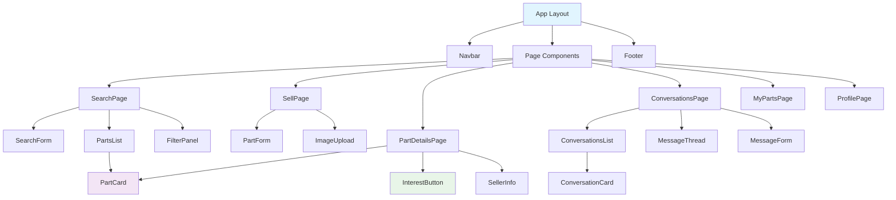
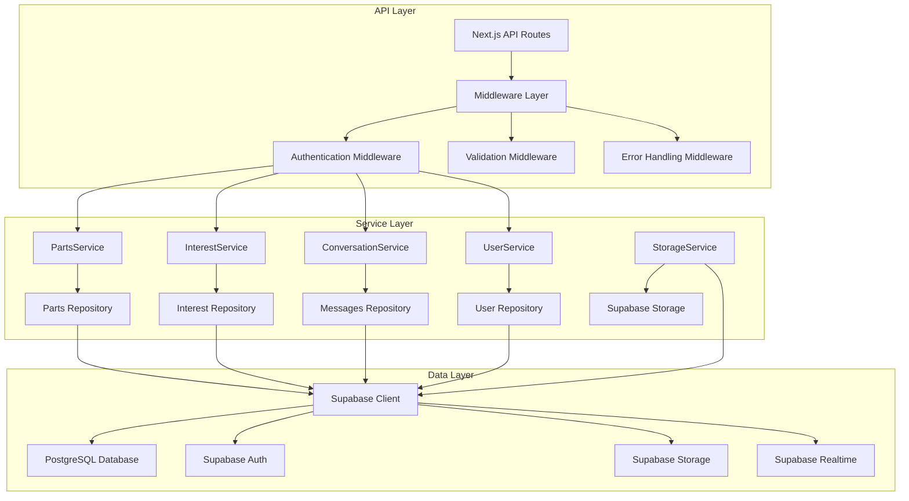

# Component Architecture - BanaYeni SanaEski

**Document Type:** Complete Component Architecture Specification  
**Created:** August 6, 2025  
**Version:** 1.0  
**Status:** Final Component Design  

---

## Component Architecture Overview

The BanaYeni SanaEski component architecture follows a clean separation between frontend React components, backend services, and data access layers. The architecture is optimized for the Turkish marketplace with emphasis on mobile-first design, Turkish text handling, and interest-gated communication workflows.

**Core Architectural Principles:**
- **Component Separation:** Clear boundaries between UI, business logic, and data access
- **Turkish Market Focus:** Components optimized for Turkish text, mobile networks, and user patterns
- **Interest-Gating Integration:** Components designed around the interest-first business model
- **Reusability:** Shared components across different marketplace features
- **Type Safety:** Full TypeScript integration across frontend and backend components

---

## Frontend Component Architecture

### Component Hierarchy Overview



### Core UI Components

#### Navbar Component
**Purpose:** Global navigation with authentication status and Turkish localization

```typescript
interface NavbarProps {
  user: User | null;
  onAuthToggle: () => void;
}

const Navbar: React.FC<NavbarProps> = ({ user, onAuthToggle }) => {
  const [isMenuOpen, setIsMenuOpen] = useState(false);

  const navigationItems = [
    { label: 'Ara', href: '/search', icon: SearchIcon },
    { label: 'Sat', href: '/sell', icon: PlusIcon, requiresAuth: true },
    { label: 'Mesajlarım', href: '/conversations', icon: ChatIcon, requiresAuth: true },
    { label: 'Parçalarım', href: '/my-parts', icon: CogIcon, requiresAuth: true },
  ];

  return (
    <nav className="bg-white shadow-md sticky top-0 z-50">
      <div className="max-w-7xl mx-auto px-4 sm:px-6 lg:px-8">
        <div className="flex justify-between items-center h-16">
          <Link href="/" className="flex items-center space-x-2">
            <Image src="/logo.png" alt="BanaYeni SanaEski" width={32} height={32} />
            <span className="text-xl font-bold text-turkish-green-600">
              BanaYeni SanaEski
            </span>
          </Link>
          
          {/* Mobile menu button */}
          <div className="md:hidden">
            <button
              onClick={() => setIsMenuOpen(!isMenuOpen)}
              className="p-2 rounded-md text-gray-600 hover:text-turkish-green-600"
            >
              <Bars3Icon className="h-6 w-6" />
            </button>
          </div>
          
          {/* Desktop navigation */}
          <div className="hidden md:flex items-center space-x-8">
            {navigationItems.map((item) => (
              <NavigationLink key={item.href} item={item} user={user} />
            ))}
            
            <AuthButton user={user} onToggle={onAuthToggle} />
          </div>
        </div>
        
        {/* Mobile menu */}
        {isMenuOpen && (
          <MobileMenu items={navigationItems} user={user} onClose={() => setIsMenuOpen(false)} />
        )}
      </div>
    </nav>
  );
};
```

**Key Features:**
- Responsive design with mobile hamburger menu
- Authentication-aware navigation
- Turkish language labels
- Sticky positioning for optimal UX

#### PartCard Component
**Purpose:** Reusable component for displaying parts in lists and detail views

```typescript
interface PartCardProps {
  part: Part;
  variant: 'list' | 'detailed' | 'compact';
  showSellerInfo?: boolean;
  onInterest?: (partId: string, type: 'interested' | 'not_interested') => void;
  currentUserInterest?: 'interested' | 'not_interested' | null;
}

const PartCard: React.FC<PartCardProps> = ({
  part,
  variant,
  showSellerInfo = false,
  onInterest,
  currentUserInterest
}) => {
  const formattedPrice = new Intl.NumberFormat('tr-TR', {
    style: 'currency',
    currency: 'TRY'
  }).format(part.price);

  const conditionColor = part.condition === 'Kullanılabilir' 
    ? 'text-green-600 bg-green-50' 
    : 'text-yellow-600 bg-yellow-50';

  return (
    <div className="bg-white rounded-lg shadow-md overflow-hidden hover:shadow-lg transition-shadow duration-200">
      {/* Image Section */}
      <div className="relative">
        <ImageCarousel 
          images={part.images} 
          alt={part.title}
          className="h-48 w-full object-cover"
        />
        
        {/* Condition Badge */}
        <div className={`absolute top-2 right-2 px-2 py-1 rounded-full text-xs font-medium ${conditionColor}`}>
          {part.condition}
        </div>
      </div>
      
      {/* Content Section */}
      <div className="p-4">
        <div className="flex justify-between items-start mb-2">
          <h3 className="text-lg font-semibold text-gray-900 line-clamp-2">
            {part.title}
          </h3>
          <span className="text-xl font-bold text-turkish-green-600 ml-2">
            {formattedPrice}
          </span>
        </div>
        
        {/* Part Reference (Critical for Turkish market) */}
        <div className="mb-2">
          <span className="text-sm text-gray-500">Parça No:</span>
          <span className="ml-2 text-sm font-mono bg-gray-100 px-2 py-1 rounded">
            {part.part_reference}
          </span>
        </div>
        
        {/* Vehicle Info */}
        <div className="flex flex-wrap gap-2 mb-3 text-sm text-gray-600">
          <span className="bg-blue-50 text-blue-700 px-2 py-1 rounded">
            {part.brand} {part.model}
          </span>
          <span className="bg-gray-50 text-gray-700 px-2 py-1 rounded">
            {part.year}
          </span>
          <span className="bg-purple-50 text-purple-700 px-2 py-1 rounded">
            {part.location_city}
          </span>
        </div>
        
        {/* Description */}
        {variant !== 'compact' && part.description && (
          <p className="text-sm text-gray-600 mb-3 line-clamp-2">
            {part.description}
          </p>
        )}
        
        {/* Seller Info */}
        {showSellerInfo && (
          <div className="flex items-center mb-3 text-sm text-gray-500">
            <UserIcon className="h-4 w-4 mr-1" />
            <span>{maskEmail(part.seller_email)}</span>
            <span className="mx-2">•</span>
            <span>{formatTimeAgo(part.created_at)}</span>
          </div>
        )}
        
        {/* Interest Actions */}
        {onInterest && (
          <InterestButtons
            partId={part.id}
            currentInterest={currentUserInterest}
            onInterest={onInterest}
          />
        )}
        
        {/* View Details Link */}
        <Link
          href={`/parts/${part.id}`}
          className="block mt-3 text-center bg-turkish-green-600 text-white py-2 px-4 rounded hover:bg-turkish-green-700 transition-colors"
        >
          Detayları Gör
        </Link>
      </div>
    </div>
  );
};
```

**Key Features:**
- Multiple display variants (list, detailed, compact)
- Turkish price and date formatting
- Part reference number prominence (critical for Turkish market)
- Integrated interest-gating buttons
- Responsive design with image carousel

#### SearchForm Component
**Purpose:** Advanced search interface optimized for Turkish parts marketplace

```typescript
interface SearchFormProps {
  initialFilters?: Partial<SearchFilters>;
  onSearch: (filters: SearchFilters) => void;
  isLoading?: boolean;
}

const SearchForm: React.FC<SearchFormProps> = ({
  initialFilters = {},
  onSearch,
  isLoading = false
}) => {
  const [filters, setFilters] = useState<SearchFilters>({
    search: '',
    part_reference: '',
    condition: undefined,
    brand: '',
    model: '',
    location_city: '',
    min_price: undefined,
    max_price: undefined,
    ...initialFilters
  });

  const turkishCities = [
    'İstanbul', 'Ankara', 'İzmir', 'Bursa', 'Antalya', 'Gaziantep',
    'Konya', 'Mersin', 'Kayseri', 'Eskişehir'
  ];

  const popularBrands = [
    'BMW', 'Mercedes', 'Audi', 'Volkswagen', 'Opel', 'Ford',
    'Renault', 'Fiat', 'Peugeot', 'Citroen'
  ];

  const handleSubmit = (e: React.FormEvent) => {
    e.preventDefault();
    onSearch(filters);
  };

  const handleReset = () => {
    setFilters({
      search: '',
      part_reference: '',
      condition: undefined,
      brand: '',
      model: '',
      location_city: '',
      min_price: undefined,
      max_price: undefined
    });
  };

  return (
    <form onSubmit={handleSubmit} className="bg-white p-6 rounded-lg shadow-md">
      <div className="grid grid-cols-1 md:grid-cols-2 lg:grid-cols-3 gap-4">
        {/* General Search */}
        <div className="lg:col-span-3">
          <label className="block text-sm font-medium text-gray-700 mb-2">
            Genel Arama
          </label>
          <input
            type="text"
            value={filters.search}
            onChange={(e) => setFilters({ ...filters, search: e.target.value })}
            placeholder="Parça adı, marka, model ara..."
            className="w-full p-3 border border-gray-300 rounded-md focus:ring-turkish-green-500 focus:border-turkish-green-500"
          />
        </div>
        
        {/* Part Reference (Critical for Turkish market) */}
        <div>
          <label className="block text-sm font-medium text-gray-700 mb-2">
            Parça Referans Numarası
          </label>
          <input
            type="text"
            value={filters.part_reference}
            onChange={(e) => setFilters({ ...filters, part_reference: e.target.value })}
            placeholder="Örn: 12317501999"
            className="w-full p-3 border border-gray-300 rounded-md focus:ring-turkish-green-500 focus:border-turkish-green-500 font-mono"
          />
          <p className="text-xs text-gray-500 mt-1">
            En doğru sonuçlar için parça numarasını kullanın
          </p>
        </div>
        
        {/* Condition */}
        <div>
          <label className="block text-sm font-medium text-gray-700 mb-2">
            Durum
          </label>
          <select
            value={filters.condition || ''}
            onChange={(e) => setFilters({ 
              ...filters, 
              condition: e.target.value as 'Kullanılabilir' | 'Arızalı' | undefined 
            })}
            className="w-full p-3 border border-gray-300 rounded-md focus:ring-turkish-green-500 focus:border-turkish-green-500"
          >
            <option value="">Tüm Durumlar</option>
            <option value="Kullanılabilir">Kullanılabilir</option>
            <option value="Arızalı">Arızalı</option>
          </select>
        </div>
        
        {/* Brand */}
        <div>
          <label className="block text-sm font-medium text-gray-700 mb-2">
            Marka
          </label>
          <Combobox 
            options={popularBrands}
            value={filters.brand}
            onChange={(value) => setFilters({ ...filters, brand: value })}
            placeholder="Marka seçin..."
            allowCustom={true}
          />
        </div>
        
        {/* Location City */}
        <div>
          <label className="block text-sm font-medium text-gray-700 mb-2">
            Şehir
          </label>
          <Combobox
            options={turkishCities}
            value={filters.location_city}
            onChange={(value) => setFilters({ ...filters, location_city: value })}
            placeholder="Şehir seçin..."
            allowCustom={true}
          />
        </div>
        
        {/* Price Range */}
        <div>
          <label className="block text-sm font-medium text-gray-700 mb-2">
            Fiyat Aralığı (₺)
          </label>
          <div className="flex space-x-2">
            <input
              type="number"
              value={filters.min_price || ''}
              onChange={(e) => setFilters({ 
                ...filters, 
                min_price: e.target.value ? parseInt(e.target.value) : undefined 
              })}
              placeholder="Min"
              className="w-1/2 p-3 border border-gray-300 rounded-md focus:ring-turkish-green-500 focus:border-turkish-green-500"
            />
            <input
              type="number"
              value={filters.max_price || ''}
              onChange={(e) => setFilters({ 
                ...filters, 
                max_price: e.target.value ? parseInt(e.target.value) : undefined 
              })}
              placeholder="Max"
              className="w-1/2 p-3 border border-gray-300 rounded-md focus:ring-turkish-green-500 focus:border-turkish-green-500"
            />
          </div>
        </div>
        
        {/* Model (appears after brand selection) */}
        {filters.brand && (
          <div>
            <label className="block text-sm font-medium text-gray-700 mb-2">
              Model
            </label>
            <input
              type="text"
              value={filters.model}
              onChange={(e) => setFilters({ ...filters, model: e.target.value })}
              placeholder={`${filters.brand} model...`}
              className="w-full p-3 border border-gray-300 rounded-md focus:ring-turkish-green-500 focus:border-turkish-green-500"
            />
          </div>
        )}
      </div>
      
      {/* Action Buttons */}
      <div className="mt-6 flex flex-col sm:flex-row gap-3">
        <button
          type="submit"
          disabled={isLoading}
          className="flex-1 bg-turkish-green-600 text-white py-3 px-6 rounded-md hover:bg-turkish-green-700 disabled:opacity-50 font-medium"
        >
          {isLoading ? (
            <div className="flex items-center justify-center">
              <LoadingSpinner className="w-5 h-5 mr-2" />
              Aranıyor...
            </div>
          ) : (
            <div className="flex items-center justify-center">
              <SearchIcon className="w-5 h-5 mr-2" />
              Parça Ara
            </div>
          )}
        </button>
        
        <button
          type="button"
          onClick={handleReset}
          className="px-6 py-3 border border-gray-300 text-gray-700 rounded-md hover:bg-gray-50"
        >
          Filtreleri Temizle
        </button>
      </div>
    </form>
  );
};
```

**Key Features:**
- Advanced filtering with Turkish cities and popular brands
- Part reference number field with special emphasis
- Responsive grid layout
- Real-time filter state management
- Loading states and validation

#### InterestButtons Component
**Purpose:** Core business logic component implementing interest-gating system

```typescript
interface InterestButtonsProps {
  partId: string;
  currentInterest?: 'interested' | 'not_interested' | null;
  onInterest: (partId: string, type: 'interested' | 'not_interested') => void;
  disabled?: boolean;
}

const InterestButtons: React.FC<InterestButtonsProps> = ({
  partId,
  currentInterest,
  onInterest,
  disabled = false
}) => {
  const [isLoading, setIsLoading] = useState(false);
  const [showConfirmation, setShowConfirmation] = useState<'interested' | 'not_interested' | null>(null);

  const handleInterest = async (type: 'interested' | 'not_interested') => {
    if (type === 'not_interested' && !showConfirmation) {
      setShowConfirmation('not_interested');
      return;
    }

    setIsLoading(true);
    try {
      await onInterest(partId, type);
      setShowConfirmation(null);
    } catch (error) {
      console.error('Interest expression failed:', error);
    } finally {
      setIsLoading(false);
    }
  };

  const getButtonState = (type: 'interested' | 'not_interested') => {
    const isSelected = currentInterest === type;
    const isOtherSelected = currentInterest && currentInterest !== type;
    
    return {
      isSelected,
      isDisabled: disabled || isLoading || Boolean(isOtherSelected),
      className: isSelected
        ? type === 'interested' 
          ? 'bg-green-600 text-white border-green-600'
          : 'bg-red-600 text-white border-red-600'
        : 'bg-white text-gray-700 border-gray-300 hover:bg-gray-50'
    };
  };

  const interestedState = getButtonState('interested');
  const notInterestedState = getButtonState('not_interested');

  if (showConfirmation === 'not_interested') {
    return (
      <div className="p-4 bg-yellow-50 border border-yellow-200 rounded-md">
        <p className="text-sm text-yellow-800 mb-3">
          Bu parça bir daha gösterilmeyecek. Emin misiniz?
        </p>
        <div className="flex space-x-2">
          <button
            onClick={() => handleInterest('not_interested')}
            className="px-3 py-1 bg-red-600 text-white text-sm rounded hover:bg-red-700"
          >
            Evet, İlgilenmiyorum
          </button>
          <button
            onClick={() => setShowConfirmation(null)}
            className="px-3 py-1 bg-gray-300 text-gray-700 text-sm rounded hover:bg-gray-400"
          >
            Vazgeç
          </button>
        </div>
      </div>
    );
  }

  return (
    <div className="flex space-x-2">
      <button
        onClick={() => handleInterest('interested')}
        disabled={interestedState.isDisabled}
        className={`
          flex-1 px-4 py-2 border rounded-md font-medium transition-colors duration-200
          ${interestedState.className}
          disabled:opacity-50 disabled:cursor-not-allowed
        `}
      >
        <div className="flex items-center justify-center">
          {isLoading && currentInterest !== 'interested' ? (
            <LoadingSpinner className="w-4 h-4 mr-2" />
          ) : (
            <HeartIcon className={`w-4 h-4 mr-2 ${interestedState.isSelected ? 'fill-current' : ''}`} />
          )}
          {interestedState.isSelected ? 'İlgileniyorum!' : 'İlgileniyorum'}
        </div>
      </button>
      
      <button
        onClick={() => handleInterest('not_interested')}
        disabled={notInterestedState.isDisabled}
        className={`
          flex-1 px-4 py-2 border rounded-md font-medium transition-colors duration-200
          ${notInterestedState.className}
          disabled:opacity-50 disabled:cursor-not-allowed
        `}
      >
        <div className="flex items-center justify-center">
          {isLoading && currentInterest !== 'not_interested' ? (
            <LoadingSpinner className="w-4 h-4 mr-2" />
          ) : (
            <XMarkIcon className="w-4 h-4 mr-2" />
          )}
          {notInterestedState.isSelected ? 'İlgilenmiyorum' : 'İlgilenmiyorum'}
        </div>
      </button>
    </div>
  );
};
```

**Key Features:**
- Core interest-gating business logic implementation
- Confirmation dialog for "not interested" actions
- Loading states during API calls
- Turkish language confirmations
- Visual feedback for selected states

---

## Backend Service Architecture

### Service Layer Organization



### Core Backend Services

#### PartsService
**Purpose:** Business logic for parts management with Turkish marketplace optimization

```typescript
export class PartsService {
  constructor(private supabase: SupabaseClient) {}

  async searchParts(filters: SearchFilters, userId?: string): Promise<SearchPartsResponse> {
    const startTime = Date.now();
    
    try {
      // Build query based on filters
      let query = this.supabase
        .from('parts')
        .select(`
          id, seller_id, title, part_reference, condition, price,
          location_city, brand, model, year, description, images,
          status, created_at,
          user_profiles!parts_seller_id_fkey (
            id, email
          )
        `)
        .eq('status', 'active');

      // Apply filters with Turkish optimization
      if (filters.search) {
        // Use trigram search for fuzzy Turkish text matching
        query = query.or(`
          title.ilike.%${filters.search}%,
          part_reference.ilike.%${filters.search}%,
          description.ilike.%${filters.search}%
        `);
      }

      if (filters.part_reference) {
        // Exact match for part reference (critical for Turkish market)
        query = query.ilike('part_reference', `%${filters.part_reference}%`);
      }

      if (filters.condition) {
        query = query.eq('condition', filters.condition);
      }

      if (filters.brand) {
        query = query.ilike('brand', `%${filters.brand}%`);
      }

      if (filters.model) {
        query = query.ilike('model', `%${filters.model}%`);
      }

      if (filters.location_city) {
        query = query.ilike('location_city', `%${filters.location_city}%`);
      }

      if (filters.min_price) {
        query = query.gte('price', filters.min_price);
      }

      if (filters.max_price) {
        query = query.lte('price', filters.max_price);
      }

      // Pagination
      const limit = filters.limit || 20;
      const offset = filters.offset || 0;
      
      query = query
        .order('created_at', { ascending: false })
        .range(offset, offset + limit - 1);

      const { data: parts, error, count } = await query;
      
      if (error) {
        throw new Error(`Search failed: ${error.message}`);
      }

      // Get user interests if authenticated
      let userInterests: Record<string, string> = {};
      if (userId && parts?.length) {
        const partIds = parts.map(p => p.id);
        const { data: interests } = await this.supabase
          .from('interests')
          .select('part_id, type')
          .eq('user_id', userId)
          .in('part_id', partIds);
          
        userInterests = interests?.reduce((acc, interest) => ({
          ...acc,
          [interest.part_id]: interest.type
        }), {}) || {};
      }

      const executionTime = Date.now() - startTime;

      return {
        success: true,
        data: {
          parts: parts?.map(part => ({
            ...part,
            seller_email: this.maskEmail(part.user_profiles?.email || ''),
            user_interest: userInterests[part.id] || null
          })) || [],
          pagination: {
            total: count || 0,
            limit,
            offset,
            has_more: (count || 0) > offset + limit
          },
          search_info: {
            query: filters.search || '',
            execution_time_ms: executionTime,
            total_results: count || 0
          }
        }
      };
    } catch (error) {
      throw new Error(`Parts search failed: ${error instanceof Error ? error.message : 'Unknown error'}`);
    }
  }

  async createPart(partData: CreatePartRequest, sellerId: string): Promise<Part> {
    try {
      // Validate part data
      const validatedData = await this.validatePartData(partData);
      
      // Handle image uploads
      const uploadedImages = await this.uploadPartImages(partData.images, sellerId);
      
      const { data: part, error } = await this.supabase
        .from('parts')
        .insert({
          ...validatedData,
          seller_id: sellerId,
          images: uploadedImages,
          status: 'active'
        })
        .select(`
          id, seller_id, title, part_reference, condition, price,
          location_city, brand, model, year, description, images,
          status, created_at, updated_at
        `)
        .single();

      if (error) {
        throw new Error(`Part creation failed: ${error.message}`);
      }

      return part;
    } catch (error) {
      throw new Error(`Failed to create part: ${error instanceof Error ? error.message : 'Unknown error'}`);
    }
  }

  async getPartDetails(partId: string, userId?: string): Promise<PartDetailsResponse> {
    try {
      const { data: part, error } = await this.supabase
        .from('parts')
        .select(`
          *, 
          user_profiles!parts_seller_id_fkey (
            id, email
          )
        `)
        .eq('id', partId)
        .eq('status', 'active')
        .single();

      if (error || !part) {
        throw new Error('Part not found');
      }

      // Get user interest if authenticated
      let userInterest = null;
      if (userId) {
        const { data: interest } = await this.supabase
          .from('interests')
          .select('type')
          .eq('user_id', userId)
          .eq('part_id', partId)
          .single();
        
        userInterest = interest?.type || null;
      }

      // Get similar parts
      const similarParts = await this.findSimilarParts(part);

      return {
        success: true,
        data: {
          part: {
            ...part,
            seller_email: this.maskEmail(part.user_profiles?.email || '')
          },
          seller_info: {
            id: part.user_profiles?.id || '',
            email: this.maskEmail(part.user_profiles?.email || '')
          },
          similar_parts: similarParts,
          user_can_express_interest: userId !== part.seller_id,
          user_already_interested: userInterest
        }
      };
    } catch (error) {
      throw new Error(`Failed to get part details: ${error instanceof Error ? error.message : 'Unknown error'}`);
    }
  }

  private async validatePartData(data: CreatePartRequest): Promise<Partial<Part>> {
    // Title validation
    if (!data.title || data.title.length < 5 || data.title.length > 200) {
      throw new Error('Başlık 5-200 karakter arasında olmalıdır');
    }

    // Part reference validation (critical for Turkish market)
    if (!data.part_reference || data.part_reference.length < 3) {
      throw new Error('Parça referans numarası en az 3 karakter olmalıdır');
    }

    // Price validation
    if (!data.price || data.price < 0 || data.price > 999999.99) {
      throw new Error('Fiyat 0-999,999.99 ₺ arasında olmalıdır');
    }

    // Turkish city validation
    const validCities = await this.getValidTurkishCities();
    if (!validCities.includes(data.location_city)) {
      throw new Error('Geçersiz şehir adı');
    }

    return {
      title: data.title.trim(),
      part_reference: data.part_reference.trim(),
      condition: data.condition,
      price: data.price,
      location_city: data.location_city,
      brand: data.brand.trim(),
      model: data.model.trim(),
      year: data.year,
      description: data.description?.trim()
    };
  }

  private maskEmail(email: string): string {
    const [username, domain] = email.split('@');
    if (username.length <= 2) return email;
    
    const maskedUsername = username.slice(0, 1) + '*'.repeat(username.length - 2) + username.slice(-1);
    return `${maskedUsername}@${domain}`;
  }

  private async uploadPartImages(images: string[], sellerId: string): Promise<string[]> {
    if (!images || images.length === 0) return [];
    
    const uploadPromises = images.map(async (imageData, index) => {
      try {
        // Convert base64 to file
        const buffer = Buffer.from(imageData, 'base64');
        const fileName = `${sellerId}/part_${Date.now()}_${index}.jpg`;
        
        const { data, error } = await this.supabase.storage
          .from('part-images')
          .upload(fileName, buffer, {
            contentType: 'image/jpeg',
            cacheControl: '3600'
          });

        if (error) {
          throw new Error(`Image upload failed: ${error.message}`);
        }

        return data.path;
      } catch (error) {
        console.error(`Failed to upload image ${index}:`, error);
        return null;
      }
    });

    const results = await Promise.all(uploadPromises);
    return results.filter(Boolean) as string[];
  }
}
```

#### InterestService
**Purpose:** Core business logic for interest-gating system

```typescript
export class InterestService {
  constructor(private supabase: SupabaseClient) {}

  async expressInterest(
    userId: string, 
    partId: string, 
    type: 'interested' | 'not_interested'
  ): Promise<ExpressInterestResponse> {
    try {
      // Validate that user is not the seller
      const { data: part, error: partError } = await this.supabase
        .from('parts')
        .select('seller_id, title, status')
        .eq('id', partId)
        .single();

      if (partError || !part) {
        throw new Error('Parça bulunamadı');
      }

      if (part.status !== 'active') {
        throw new Error('Bu parça artık aktif değil');
      }

      if (part.seller_id === userId) {
        throw new Error('Kendi parçanıza ilgi bildiremezsiniz');
      }

      // Check for existing interest
      const { data: existingInterest } = await this.supabase
        .from('interests')
        .select('id, type, conversation_id')
        .eq('user_id', userId)
        .eq('part_id', partId)
        .single();

      if (existingInterest) {
        throw new Error('Bu parça için zaten ilgi bildirdiniz');
      }

      // Create interest record
      const { data: interest, error: interestError } = await this.supabase
        .from('interests')
        .insert({
          user_id: userId,
          part_id: partId,
          type
        })
        .select('id, type')
        .single();

      if (interestError) {
        throw new Error(`İlgi kaydedilemedi: ${interestError.message}`);
      }

      let conversationId = null;
      
      // Create conversation if interested
      if (type === 'interested') {
        const { data: conversation, error: conversationError } = await this.supabase
          .from('conversations')
          .insert({
            buyer_id: userId,
            seller_id: part.seller_id,
            part_id: partId,
            status: 'active'
          })
          .select('id')
          .single();

        if (conversationError) {
          // If conversation already exists, get it
          const { data: existingConversation } = await this.supabase
            .from('conversations')
            .select('id')
            .eq('buyer_id', userId)
            .eq('part_id', partId)
            .single();
          
          conversationId = existingConversation?.id || null;
        } else {
          conversationId = conversation.id;
        }

        // Update interest with conversation_id
        if (conversationId) {
          await this.supabase
            .from('interests')
            .update({ conversation_id: conversationId })
            .eq('id', interest.id);
        }
      }

      const message = type === 'interested' 
        ? 'İlginiz kaydedildi! Satıcı ile sohbet başlatabilirsiniz.'
        : 'Bu parça bir daha gösterilmeyecek.';

      return {
        success: true,
        data: {
          interest: {
            id: interest.id,
            type: interest.type,
            conversation_id: conversationId
          }
        },
        message
      };
    } catch (error) {
      throw new Error(`İlgi bildirme başarısız: ${error instanceof Error ? error.message : 'Bilinmeyen hata'}`);
    }
  }

  async getUserInterests(userId: string, filters: InterestFilters = {}): Promise<UserInterestsResponse> {
    try {
      let query = this.supabase
        .from('interests')
        .select(`
          id, type, created_at, conversation_id,
          parts (
            id, title, part_reference, condition, price,
            location_city, brand, model, year, images, status
          )
        `)
        .eq('user_id', userId);

      if (filters.type) {
        query = query.eq('type', filters.type);
      }

      const limit = filters.limit || 20;
      const offset = filters.offset || 0;

      query = query
        .order('created_at', { ascending: false })
        .range(offset, offset + limit - 1);

      const { data: interests, error, count } = await query;

      if (error) {
        throw new Error(`Failed to get user interests: ${error.message}`);
      }

      return {
        success: true,
        data: {
          interests: interests?.map(interest => ({
            id: interest.id,
            type: interest.type,
            part: interest.parts as Part,
            conversation_id: interest.conversation_id,
            created_at: interest.created_at
          })) || [],
          pagination: {
            total: count || 0,
            limit,
            offset,
            has_more: (count || 0) > offset + limit
          }
        }
      };
    } catch (error) {
      throw new Error(`Failed to get interests: ${error instanceof Error ? error.message : 'Unknown error'}`);
    }
  }
}
```

#### ConversationService
**Purpose:** Messaging system with Turkish localization

```typescript
export class ConversationService {
  constructor(private supabase: SupabaseClient) {}

  async getUserConversations(userId: string, filters: ConversationFilters = {}): Promise<ConversationsResponse> {
    try {
      let query = this.supabase
        .from('conversations')
        .select(`
          id, buyer_id, seller_id, status, created_at, last_message_at,
          parts (
            id, title, part_reference, condition, price, images
          ),
          messages!inner (
            id, content, created_at, sender_id,
            count
          )
        `)
        .or(`buyer_id.eq.${userId},seller_id.eq.${userId}`);

      if (filters.status) {
        query = query.eq('status', filters.status);
      }

      const limit = filters.limit || 20;
      const offset = filters.offset || 0;

      query = query
        .order('last_message_at', { ascending: false })
        .range(offset, offset + limit - 1);

      const { data: conversations, error, count } = await query;

      if (error) {
        throw new Error(`Failed to get conversations: ${error.message}`);
      }

      // Get unread message counts and other user info
      const conversationsWithDetails = await Promise.all(
        (conversations || []).map(async (conv) => {
          const otherUserId = conv.buyer_id === userId ? conv.seller_id : conv.buyer_id;
          
          // Get other user info
          const { data: otherUser } = await this.supabase
            .from('user_profiles')
            .select('id, email')
            .eq('id', otherUserId)
            .single();

          // Get unread count
          const { count: unreadCount } = await this.supabase
            .from('messages')
            .select('id', { count: 'exact' })
            .eq('conversation_id', conv.id)
            .neq('sender_id', userId)
            .is('read_at', null);

          return {
            id: conv.id,
            buyer_id: conv.buyer_id,
            seller_id: conv.seller_id,
            part: conv.parts as Part,
            other_user: {
              id: otherUser?.id || '',
              email: this.maskEmail(otherUser?.email || '')
            },
            status: conv.status,
            last_message_at: conv.last_message_at,
            unread_count: unreadCount || 0,
            user_role: conv.buyer_id === userId ? 'buyer' : 'seller'
          };
        })
      );

      return {
        success: true,
        data: {
          conversations: conversationsWithDetails,
          pagination: {
            total: count || 0,
            limit,
            offset,
            has_more: (count || 0) > offset + limit
          }
        }
      };
    } catch (error) {
      throw new Error(`Failed to get conversations: ${error instanceof Error ? error.message : 'Unknown error'}`);
    }
  }

  async getConversationMessages(
    conversationId: string,
    userId: string,
    options: MessageOptions = {}
  ): Promise<MessagesResponse> {
    try {
      // Verify user is participant
      const { data: conversation, error: convError } = await this.supabase
        .from('conversations')
        .select('buyer_id, seller_id, parts (title)')
        .eq('id', conversationId)
        .single();

      if (convError || !conversation) {
        throw new Error('Sohbet bulunamadı');
      }

      if (conversation.buyer_id !== userId && conversation.seller_id !== userId) {
        throw new Error('Bu sohbete erişim yetkiniz yok');
      }

      let query = this.supabase
        .from('messages')
        .select('id, sender_id, content, created_at, read_at')
        .eq('conversation_id', conversationId);

      if (options.before) {
        query = query.lt('created_at', options.before);
      }

      const limit = options.limit || 50;
      
      query = query
        .order('created_at', { ascending: false })
        .limit(limit);

      const { data: messages, error } = await query;

      if (error) {
        throw new Error(`Failed to get messages: ${error.message}`);
      }

      // Mark messages as read if requested
      if (options.mark_as_read !== false) {
        await this.markMessagesAsRead(conversationId, userId);
      }

      const messagesWithUserFlag = messages?.map(msg => ({
        ...msg,
        is_own_message: msg.sender_id === userId
      })).reverse() || []; // Reverse to show oldest first

      // Get other user info for header
      const otherUserId = conversation.buyer_id === userId ? conversation.seller_id : conversation.buyer_id;
      const { data: otherUser } = await this.supabase
        .from('user_profiles')
        .select('email')
        .eq('id', otherUserId)
        .single();

      return {
        success: true,
        data: {
          messages: messagesWithUserFlag,
          conversation: {
            id: conversationId,
            part_title: conversation.parts?.title || '',
            other_user_email: this.maskEmail(otherUser?.email || '')
          },
          pagination: {
            has_more: (messages?.length || 0) >= limit,
            oldest_message_timestamp: messages?.length ? messages[messages.length - 1].created_at : undefined
          }
        }
      };
    } catch (error) {
      throw new Error(`Failed to get messages: ${error instanceof Error ? error.message : 'Unknown error'}`);
    }
  }

  async sendMessage(
    conversationId: string,
    senderId: string,
    content: string
  ): Promise<SendMessageResponse> {
    try {
      // Validate message content
      if (!content || content.trim().length === 0) {
        throw new Error('Mesaj içeriği boş olamaz');
      }

      if (content.length > 2000) {
        throw new Error('Mesaj çok uzun (max 2000 karakter)');
      }

      // Verify sender is participant
      const { data: conversation, error: convError } = await this.supabase
        .from('conversations')
        .select('buyer_id, seller_id, status')
        .eq('id', conversationId)
        .single();

      if (convError || !conversation) {
        throw new Error('Sohbet bulunamadı');
      }

      if (conversation.buyer_id !== senderId && conversation.seller_id !== senderId) {
        throw new Error('Bu sohbete mesaj gönderme yetkiniz yok');
      }

      if (conversation.status !== 'active') {
        throw new Error('Bu sohbet kapatılmış');
      }

      // Send message
      const { data: message, error: messageError } = await this.supabase
        .from('messages')
        .insert({
          conversation_id: conversationId,
          sender_id: senderId,
          content: content.trim()
        })
        .select('id, conversation_id, sender_id, content, created_at')
        .single();

      if (messageError) {
        throw new Error(`Mesaj gönderilemedi: ${messageError.message}`);
      }

      // Update conversation last_message_at (handled by trigger)
      
      return {
        success: true,
        data: { message },
        message: 'Mesaj gönderildi'
      };
    } catch (error) {
      throw new Error(`Failed to send message: ${error instanceof Error ? error.message : 'Unknown error'}`);
    }
  }

  private async markMessagesAsRead(conversationId: string, userId: string): Promise<void> {
    await this.supabase
      .from('messages')
      .update({ read_at: new Date().toISOString() })
      .eq('conversation_id', conversationId)
      .neq('sender_id', userId)
      .is('read_at', null);
  }

  private maskEmail(email: string): string {
    const [username, domain] = email.split('@');
    if (username.length <= 2) return email;
    
    const maskedUsername = username.slice(0, 1) + '*'.repeat(username.length - 2) + username.slice(-1);
    return `${maskedUsername}@${domain}`;
  }
}
```

---

## Component Integration Patterns

### Frontend-Backend Communication

```typescript
// Custom hook for parts search with Turkish optimization
export const usePartsSearch = (filters: SearchFilters) => {
  return useQuery({
    queryKey: ['parts', 'search', filters],
    queryFn: async () => {
      const response = await fetch('/api/parts', {
        method: 'POST',
        headers: { 'Content-Type': 'application/json' },
        body: JSON.stringify(filters)
      });
      
      if (!response.ok) {
        throw new Error('Arama başarısız oldu');
      }
      
      return response.json();
    },
    staleTime: 5 * 60 * 1000, // 5 minutes cache
    enabled: Boolean(filters.search || filters.part_reference),
    retry: (failureCount, error) => {
      // Don't retry on client errors
      if (error instanceof Error && error.message.includes('400')) {
        return false;
      }
      return failureCount < 3;
    }
  });
};

// Custom hook for interest management
export const useInterestManagement = () => {
  const queryClient = useQueryClient();
  
  return useMutation({
    mutationFn: async ({ partId, type }: { partId: string; type: 'interested' | 'not_interested' }) => {
      const response = await fetch(`/api/parts/${partId}/interest`, {
        method: 'POST',
        headers: { 'Content-Type': 'application/json' },
        credentials: 'include',
        body: JSON.stringify({ type })
      });
      
      if (!response.ok) {
        const error = await response.json();
        throw new Error(error.error?.message || 'İlgi bildirme başarısız');
      }
      
      return response.json();
    },
    onSuccess: (data, variables) => {
      // Invalidate related queries
      queryClient.invalidateQueries(['parts', 'search']);
      queryClient.invalidateQueries(['parts', variables.partId]);
      queryClient.invalidateQueries(['interests']);
      
      if (data.data.interest.conversation_id) {
        queryClient.invalidateQueries(['conversations']);
      }
    }
  });
};
```

### Error Handling Pattern

```typescript
// Centralized error handling for Turkish marketplace
export class TurkishMarketplaceError extends Error {
  constructor(
    message: string,
    public code: string,
    public statusCode: number = 500,
    public details?: any
  ) {
    super(message);
    this.name = 'TurkishMarketplaceError';
  }
}

// Error boundary component
export class ErrorBoundary extends React.Component<
  { children: React.ReactNode },
  { hasError: boolean; error?: Error }
> {
  constructor(props: { children: React.ReactNode }) {
    super(props);
    this.state = { hasError: false };
  }

  static getDerivedStateFromError(error: Error) {
    return { hasError: true, error };
  }

  componentDidCatch(error: Error, errorInfo: React.ErrorInfo) {
    console.error('Turkish Marketplace Error:', error, errorInfo);
    
    // Track error for monitoring
    if (typeof window !== 'undefined') {
      (window as any).gtag?.('event', 'exception', {
        description: error.message,
        fatal: false
      });
    }
  }

  render() {
    if (this.state.hasError) {
      return (
        <div className="min-h-screen flex items-center justify-center bg-gray-50">
          <div className="max-w-md w-full bg-white shadow-lg rounded-lg p-6">
            <div className="flex items-center justify-center w-12 h-12 mx-auto bg-red-100 rounded-full mb-4">
              <ExclamationTriangleIcon className="w-6 h-6 text-red-600" />
            </div>
            <h2 className="text-center text-xl font-semibold text-gray-900 mb-2">
              Bir Hata Oluştu
            </h2>
            <p className="text-center text-gray-600 mb-4">
              Beklenmeyen bir hata meydana geldi. Lütfen sayfayı yenileyin veya daha sonra tekrar deneyin.
            </p>
            <div className="flex space-x-3">
              <button
                onClick={() => window.location.reload()}
                className="flex-1 bg-turkish-green-600 text-white py-2 px-4 rounded hover:bg-turkish-green-700"
              >
                Sayfayı Yenile
              </button>
              <Link
                href="/"
                className="flex-1 bg-gray-200 text-gray-800 py-2 px-4 rounded hover:bg-gray-300 text-center"
              >
                Ana Sayfa
              </Link>
            </div>
          </div>
        </div>
      );
    }

    return this.props.children;
  }
}
```

---

## Component Performance Optimization

### React Component Optimization

```typescript
// Memoized part card for performance
export const PartCard = React.memo<PartCardProps>(({ part, variant, onInterest, currentUserInterest }) => {
  // Component implementation...
}, (prevProps, nextProps) => {
  // Custom comparison for performance
  return (
    prevProps.part.id === nextProps.part.id &&
    prevProps.part.updated_at === nextProps.part.updated_at &&
    prevProps.currentUserInterest === nextProps.currentUserInterest
  );
});

// Virtual scrolling for large parts lists
export const VirtualizedPartsList: React.FC<{ parts: Part[] }> = ({ parts }) => {
  const [visibleRange, setVisibleRange] = useState({ start: 0, end: 20 });
  const listRef = useRef<HTMLDivElement>(null);

  useEffect(() => {
    const handleScroll = throttle(() => {
      if (listRef.current) {
        const scrollTop = listRef.current.scrollTop;
        const itemHeight = 320; // Approximate height of PartCard
        const containerHeight = listRef.current.clientHeight;
        
        const start = Math.floor(scrollTop / itemHeight);
        const end = start + Math.ceil(containerHeight / itemHeight) + 5; // Buffer
        
        setVisibleRange({ start, end });
      }
    }, 100);

    const element = listRef.current;
    element?.addEventListener('scroll', handleScroll);
    
    return () => element?.removeEventListener('scroll', handleScroll);
  }, []);

  const visibleParts = parts.slice(visibleRange.start, visibleRange.end);

  return (
    <div ref={listRef} className="h-screen overflow-y-auto">
      <div style={{ height: visibleRange.start * 320 }} />
      {visibleParts.map((part, index) => (
        <PartCard
          key={part.id}
          part={part}
          variant="list"
          style={{ position: 'absolute', top: (visibleRange.start + index) * 320 }}
        />
      ))}
      <div style={{ height: (parts.length - visibleRange.end) * 320 }} />
    </div>
  );
};
```

---

## Conclusion

The BanaYeni SanaEski component architecture provides a comprehensive foundation for the Turkish automotive parts marketplace. The architecture successfully balances performance, maintainability, and user experience while incorporating Turkish market-specific optimizations.

**Key Architectural Strengths:**

**Frontend Components:**
- **Turkish Market Focus:** Components optimized for Turkish text, mobile performance, and local user patterns
- **Interest-Gating Integration:** Business logic embedded in component design
- **Reusable Design:** Modular components supporting different marketplace views
- **Performance Optimization:** Memoization, virtual scrolling, and efficient rendering

**Backend Services:**
- **Clean Separation:** Clear boundaries between API, business logic, and data layers
- **Turkish Optimization:** Database queries and text processing optimized for Turkish content
- **Error Handling:** Comprehensive error management with Turkish localization
- **Type Safety:** Full TypeScript integration across all service layers

**Integration Patterns:**
- **Unified Communication:** Consistent patterns between frontend and backend
- **Error Boundaries:** Robust error handling with user-friendly Turkish messages
- **Performance Focus:** Caching strategies and optimization for Turkish mobile networks
- **Monitoring Integration:** Error tracking and analytics for continuous improvement

This component architecture positions BanaYeni SanaEski for sustainable growth while maintaining the development velocity and code quality necessary for success in the competitive Turkish automotive parts market.

---

*This component architecture specification serves as the complete reference for all frontend and backend component development in the BanaYeni SanaEski project.*