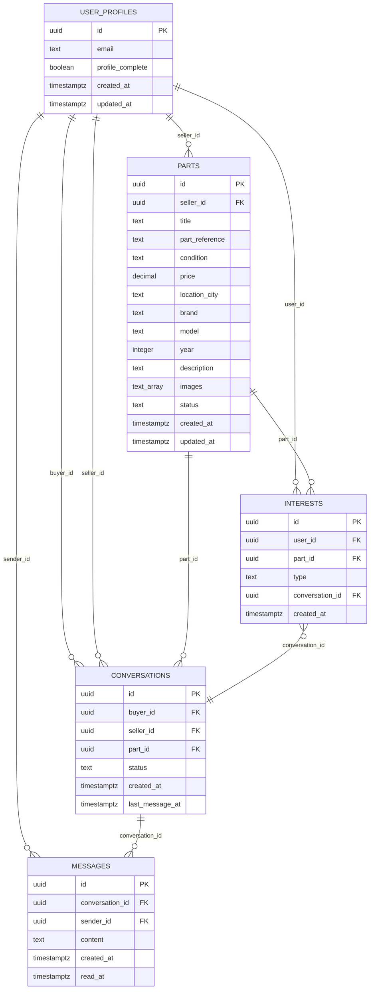
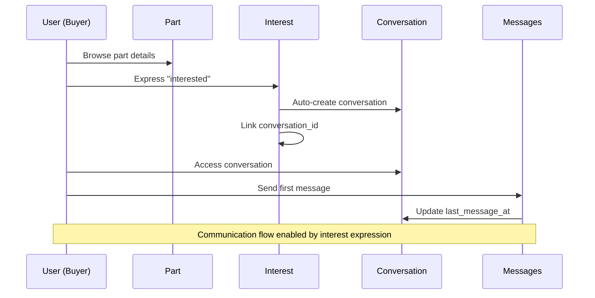

# Data Models - BanaYeni SanaEski

**Document Type:** Complete Data Architecture Specification  
**Created:** August 6, 2025  
**Version:** 1.0  
**Status:** Final Data Model Design  

---

## Data Architecture Overview

The BanaYeni SanaEski data model is designed specifically for the Turkish automotive parts marketplace, optimized for Supabase PostgreSQL with Turkish text search capabilities. The model supports the core business logic of interest-gated communication while enabling efficient parts discovery through reference numbers.

**Key Design Principles:**
- **Turkish Market Optimization:** Text search, currency formatting, location handling
- **Interest-Gating Support:** Explicit data flow from interest to conversation
- **Part Reference Focus:** Critical field enabling precise parts matching
- **Performance Optimization:** Indexes and queries optimized for common access patterns
- **Data Integrity:** Comprehensive constraints and relationships

---

## Core Data Entities

### Entity Relationship Overview



---

## Detailed Entity Specifications

### User Profile Entity

**Purpose:** Extends Supabase Auth with marketplace-specific user data and preferences.

```typescript
interface UserProfile {
  id: string;                    // UUID - References auth.users(id)
  email: string;                 // User's email from Supabase Auth
  profile_complete: boolean;     // Whether user completed marketplace setup
  created_at: string;           // Account creation timestamp
  updated_at: string;           // Last profile update timestamp
}
```

**Database Schema:**
```sql
CREATE TABLE public.user_profiles (
    id UUID REFERENCES auth.users(id) ON DELETE CASCADE PRIMARY KEY,
    email TEXT NOT NULL,
    profile_complete BOOLEAN DEFAULT FALSE,
    created_at TIMESTAMPTZ DEFAULT NOW(),
    updated_at TIMESTAMPTZ DEFAULT NOW(),
    
    -- Constraints
    CONSTRAINT valid_email CHECK (email ~* '^[A-Za-z0-9._%-]+@[A-Za-z0-9.-]+\.[A-Za-z]{2,4}$')
);

-- Row Level Security
ALTER TABLE public.user_profiles ENABLE ROW LEVEL SECURITY;

CREATE POLICY "Users can view own profile" ON public.user_profiles
    FOR SELECT USING (auth.uid() = id);

CREATE POLICY "Users can update own profile" ON public.user_profiles
    FOR UPDATE USING (auth.uid() = id);
```

**Business Rules:**
- One-to-one relationship with Supabase Auth users
- Email automatically synced from auth system
- Profile completion tracked for onboarding flow
- Turkish email domains supported

**Usage Patterns:**
- Profile lookup during authentication
- Onboarding completion tracking
- User preference management

---

### Parts Entity

**Purpose:** Core marketplace entity representing automotive/machinery parts for sale, optimized for Turkish market search patterns.

```typescript
interface Part {
  id: string;                    // UUID - Primary key
  seller_id: string;            // UUID - Foreign key to UserProfile
  title: string;                // Part name/description
  part_reference: string;       // Critical: OEM/aftermarket part number
  condition: 'Kullanılabilir' | 'Arızalı';  // Turkish condition labels
  price: number;                // Price in Turkish Lira
  location_city: string;        // Turkish city name
  brand: string;                // Vehicle/machine brand (BMW, Mercedes, etc.)
  model: string;                // Specific model (E46, W203, etc.)
  year: number;                 // Manufacturing year
  description?: string;         // Optional detailed description
  images: string[];             // Array of Supabase Storage URLs
  status: 'active' | 'sold' | 'inactive';  // Listing status
  created_at: string;          // Listing creation timestamp
  updated_at: string;          // Last modification timestamp
}
```

**Database Schema:**
```sql
CREATE TABLE public.parts (
    id UUID DEFAULT uuid_generate_v4() PRIMARY KEY,
    seller_id UUID REFERENCES public.user_profiles(id) ON DELETE CASCADE NOT NULL,
    title TEXT NOT NULL,
    part_reference TEXT NOT NULL,  -- Critical for Turkish marketplace
    condition TEXT NOT NULL CHECK (condition IN ('Kullanılabilir', 'Arızalı')),
    price DECIMAL(10,2) NOT NULL CHECK (price >= 0),
    location_city TEXT NOT NULL,
    brand TEXT NOT NULL,
    model TEXT NOT NULL,
    year INTEGER NOT NULL CHECK (year >= 1900 AND year <= 2030),
    description TEXT,
    images TEXT[] DEFAULT '{}',
    status TEXT DEFAULT 'active' CHECK (status IN ('active', 'sold', 'inactive')),
    created_at TIMESTAMPTZ DEFAULT NOW(),
    updated_at TIMESTAMPTZ DEFAULT NOW(),
    
    -- Additional constraints
    CONSTRAINT valid_price CHECK (price <= 999999.99),  -- Maximum price limit
    CONSTRAINT valid_title_length CHECK (length(title) >= 5 AND length(title) <= 200),
    CONSTRAINT valid_part_reference CHECK (length(part_reference) >= 3),
    CONSTRAINT valid_images_count CHECK (array_length(images, 1) <= 5)
);

-- Performance indexes for Turkish marketplace
CREATE INDEX idx_parts_part_reference ON public.parts USING GIN (part_reference gin_trgm_ops);
CREATE INDEX idx_parts_search_text ON public.parts USING GIN (
    (title || ' ' || part_reference || ' ' || COALESCE(description, '')) gin_trgm_ops
);
CREATE INDEX idx_parts_brand_model ON public.parts (brand, model);
CREATE INDEX idx_parts_location_city ON public.parts (location_city);
CREATE INDEX idx_parts_condition ON public.parts (condition);
CREATE INDEX idx_parts_price ON public.parts (price);
CREATE INDEX idx_parts_year ON public.parts (year);
CREATE INDEX idx_parts_status_created ON public.parts (status, created_at DESC);

-- Turkish text search optimization
CREATE INDEX idx_parts_turkish_fts ON public.parts USING GIN (
    to_tsvector('turkish', title || ' ' || part_reference || ' ' || COALESCE(description, ''))
);

-- Enable trigram extension for fuzzy text search
CREATE EXTENSION IF NOT EXISTS pg_trgm;
```

**Row Level Security:**
```sql
ALTER TABLE public.parts ENABLE ROW LEVEL SECURITY;

-- Public can view active parts
CREATE POLICY "Anyone can view active parts" ON public.parts
    FOR SELECT USING (status = 'active');

-- Sellers can manage their own parts
CREATE POLICY "Sellers can manage own parts" ON public.parts
    FOR ALL USING (auth.uid() = seller_id);
```

**Business Rules:**
- **Part Reference Mandatory:** Critical for Turkish marketplace precision
- **Condition Enum:** Only 'Kullanılabilir' (working) or 'Arızalı' (broken)
- **Price in Turkish Lira:** Decimal precision for currency
- **Image Limit:** Maximum 5 images per part for performance
- **Location Simplified:** City-level granularity sufficient for Turkey

**Search Optimization:**
```sql
-- Optimized search function for Turkish text
CREATE OR REPLACE FUNCTION search_parts(
    search_query TEXT DEFAULT NULL,
    part_ref TEXT DEFAULT NULL,
    part_condition TEXT DEFAULT NULL,
    part_brand TEXT DEFAULT NULL,
    part_model TEXT DEFAULT NULL,
    part_city TEXT DEFAULT NULL,
    min_price DECIMAL DEFAULT NULL,
    max_price DECIMAL DEFAULT NULL,
    limit_count INTEGER DEFAULT 20,
    offset_count INTEGER DEFAULT 0
) RETURNS TABLE (
    id UUID,
    seller_id UUID,
    title TEXT,
    part_reference TEXT,
    condition TEXT,
    price DECIMAL,
    location_city TEXT,
    brand TEXT,
    model TEXT,
    year INTEGER,
    description TEXT,
    images TEXT[],
    created_at TIMESTAMPTZ,
    status TEXT
) AS $$
BEGIN
    RETURN QUERY
    SELECT p.id, p.seller_id, p.title, p.part_reference, p.condition, 
           p.price, p.location_city, p.brand, p.model, p.year, 
           p.description, p.images, p.created_at, p.status
    FROM public.parts p
    WHERE p.status = 'active'
        AND (search_query IS NULL OR 
             (p.title || ' ' || p.part_reference || ' ' || COALESCE(p.description, '')) 
             ILIKE '%' || search_query || '%')
        AND (part_ref IS NULL OR p.part_reference ILIKE '%' || part_ref || '%')
        AND (part_condition IS NULL OR p.condition = part_condition)
        AND (part_brand IS NULL OR p.brand ILIKE '%' || part_brand || '%')
        AND (part_model IS NULL OR p.model ILIKE '%' || part_model || '%')
        AND (part_city IS NULL OR p.location_city ILIKE '%' || part_city || '%')
        AND (min_price IS NULL OR p.price >= min_price)
        AND (max_price IS NULL OR p.price <= max_price)
    ORDER BY p.created_at DESC
    LIMIT limit_count
    OFFSET offset_count;
END;
$$ LANGUAGE plpgsql SECURITY DEFINER;
```

---

### Interests Entity

**Purpose:** Implements interest-gating business logic, tracking user interest in specific parts and controlling conversation access.

```typescript
interface Interest {
  id: string;                    // UUID - Primary key
  user_id: string;              // UUID - Foreign key to UserProfile (buyer)
  part_id: string;              // UUID - Foreign key to Part
  type: 'interested' | 'not_interested';  // Interest type
  conversation_id?: string;     // UUID - Optional link to created conversation
  created_at: string;          // Interest expression timestamp
}
```

**Database Schema:**
```sql
CREATE TABLE public.interests (
    id UUID DEFAULT uuid_generate_v4() PRIMARY KEY,
    user_id UUID REFERENCES public.user_profiles(id) ON DELETE CASCADE NOT NULL,
    part_id UUID REFERENCES public.parts(id) ON DELETE CASCADE NOT NULL,
    type TEXT NOT NULL CHECK (type IN ('interested', 'not_interested')),
    conversation_id UUID, -- Will reference conversations.id
    created_at TIMESTAMPTZ DEFAULT NOW(),
    
    -- Ensure one interest per user per part
    UNIQUE(user_id, part_id)
);

-- Performance indexes
CREATE INDEX idx_interests_user_part ON public.interests (user_id, part_id);
CREATE INDEX idx_interests_part_type ON public.interests (part_id, type);
CREATE INDEX idx_interests_conversation ON public.interests (conversation_id) WHERE conversation_id IS NOT NULL;
```

**Row Level Security:**
```sql
ALTER TABLE public.interests ENABLE ROW LEVEL SECURITY;

-- Users can only manage their own interests
CREATE POLICY "Users can manage own interests" ON public.interests
    FOR ALL USING (auth.uid() = user_id);

-- Sellers can view interests in their parts
CREATE POLICY "Sellers can view part interests" ON public.interests
    FOR SELECT USING (
        EXISTS (
            SELECT 1 FROM public.parts 
            WHERE parts.id = interests.part_id 
            AND parts.seller_id = auth.uid()
        )
    );
```

**Business Rules:**
- **Unique Constraint:** One interest record per user-part combination
- **Type Enforcement:** Only 'interested' or 'not_interested' values allowed
- **Conversation Linking:** 'interested' type creates conversation, links via conversation_id
- **Exclusion Logic:** 'not_interested' prevents part from appearing in future searches for that user

**Business Logic Functions:**
```sql
-- Function to handle interest expression with business rules
CREATE OR REPLACE FUNCTION express_interest(
    p_user_id UUID,
    p_part_id UUID,
    p_type TEXT
) RETURNS TABLE (
    interest_id UUID,
    conversation_id UUID
) AS $$
DECLARE
    v_interest_id UUID;
    v_conversation_id UUID;
    v_seller_id UUID;
BEGIN
    -- Validate that user is not the seller
    SELECT seller_id INTO v_seller_id 
    FROM public.parts 
    WHERE id = p_part_id AND status = 'active';
    
    IF v_seller_id = p_user_id THEN
        RAISE EXCEPTION 'Cannot express interest in your own part';
    END IF;
    
    -- Insert or update interest
    INSERT INTO public.interests (user_id, part_id, type)
    VALUES (p_user_id, p_part_id, p_type)
    ON CONFLICT (user_id, part_id) 
    DO UPDATE SET type = p_type, created_at = NOW()
    RETURNING id INTO v_interest_id;
    
    -- Create conversation if interested
    IF p_type = 'interested' THEN
        INSERT INTO public.conversations (buyer_id, seller_id, part_id)
        VALUES (p_user_id, v_seller_id, p_part_id)
        ON CONFLICT (buyer_id, part_id) DO NOTHING
        RETURNING id INTO v_conversation_id;
        
        -- Update interest with conversation_id
        UPDATE public.interests 
        SET conversation_id = v_conversation_id
        WHERE id = v_interest_id;
    END IF;
    
    RETURN QUERY SELECT v_interest_id, v_conversation_id;
END;
$$ LANGUAGE plpgsql SECURITY DEFINER;
```

---

### Conversations Entity

**Purpose:** Manages buyer-seller communication sessions, created automatically when interest is expressed.

```typescript
interface Conversation {
  id: string;                    // UUID - Primary key
  buyer_id: string;             // UUID - Foreign key to UserProfile
  seller_id: string;            // UUID - Foreign key to UserProfile
  part_id: string;              // UUID - Foreign key to Part
  status: 'active' | 'closed';  // Conversation status
  created_at: string;          // Conversation start timestamp
  last_message_at: string;     // Most recent message timestamp
}
```

**Database Schema:**
```sql
CREATE TABLE public.conversations (
    id UUID DEFAULT uuid_generate_v4() PRIMARY KEY,
    buyer_id UUID REFERENCES public.user_profiles(id) ON DELETE CASCADE NOT NULL,
    seller_id UUID REFERENCES public.user_profiles(id) ON DELETE CASCADE NOT NULL,
    part_id UUID REFERENCES public.parts(id) ON DELETE CASCADE NOT NULL,
    status TEXT DEFAULT 'active' CHECK (status IN ('active', 'closed')),
    created_at TIMESTAMPTZ DEFAULT NOW(),
    last_message_at TIMESTAMPTZ DEFAULT NOW(),
    
    -- Business rules
    CHECK (buyer_id != seller_id),  -- Buyer and seller must be different
    UNIQUE(buyer_id, part_id)       -- One conversation per buyer-part combination
);

-- Performance indexes
CREATE INDEX idx_conversations_buyer ON public.conversations (buyer_id, last_message_at DESC);
CREATE INDEX idx_conversations_seller ON public.conversations (seller_id, last_message_at DESC);
CREATE INDEX idx_conversations_part ON public.conversations (part_id);
CREATE INDEX idx_conversations_active ON public.conversations (status, last_message_at DESC) WHERE status = 'active';
```

**Row Level Security:**
```sql
ALTER TABLE public.conversations ENABLE ROW LEVEL SECURITY;

-- Only conversation participants can access
CREATE POLICY "Participants can access conversation" ON public.conversations
    FOR ALL USING (auth.uid() = buyer_id OR auth.uid() = seller_id);
```

**Business Rules:**
- **Unique Buyer-Part:** One conversation per buyer per part
- **Automatic Creation:** Created when 'interested' type interest is expressed
- **Participant Restriction:** Only buyer and seller can access conversation
- **Status Management:** Active by default, can be closed

---

### Messages Entity

**Purpose:** Individual messages within conversations, supporting async communication between buyers and sellers.

```typescript
interface Message {
  id: string;                    // UUID - Primary key
  conversation_id: string;      // UUID - Foreign key to Conversation
  sender_id: string;            // UUID - Foreign key to UserProfile
  content: string;              // Message content (max 2000 characters)
  created_at: string;          // Message timestamp
  read_at?: string;            // Optional: when message was read
}
```

**Database Schema:**
```sql
CREATE TABLE public.messages (
    id UUID DEFAULT uuid_generate_v4() PRIMARY KEY,
    conversation_id UUID REFERENCES public.conversations(id) ON DELETE CASCADE NOT NULL,
    sender_id UUID REFERENCES public.user_profiles(id) ON DELETE CASCADE NOT NULL,
    content TEXT NOT NULL,
    created_at TIMESTAMPTZ DEFAULT NOW(),
    read_at TIMESTAMPTZ,
    
    -- Content constraints
    CONSTRAINT valid_content_length CHECK (length(content) > 0 AND length(content) <= 2000),
    CONSTRAINT no_empty_content CHECK (trim(content) != '')
);

-- Performance indexes
CREATE INDEX idx_messages_conversation_time ON public.messages (conversation_id, created_at DESC);
CREATE INDEX idx_messages_sender ON public.messages (sender_id);
CREATE INDEX idx_messages_unread ON public.messages (conversation_id, read_at) WHERE read_at IS NULL;
CREATE INDEX idx_messages_recent ON public.messages (created_at DESC) WHERE created_at > NOW() - INTERVAL '30 days';
```

**Row Level Security:**
```sql
ALTER TABLE public.messages ENABLE ROW LEVEL SECURITY;

-- Only conversation participants can access messages
CREATE POLICY "Participants can access messages" ON public.messages
    FOR ALL USING (
        EXISTS (
            SELECT 1 FROM public.conversations 
            WHERE conversations.id = messages.conversation_id 
            AND (conversations.buyer_id = auth.uid() OR conversations.seller_id = auth.uid())
        )
    );
```

**Business Rules:**
- **Content Limits:** 2000 character maximum for Turkish mobile optimization
- **Participant Access:** Only buyer and seller can read/send messages
- **Read Tracking:** Optional read receipt functionality
- **Content Validation:** No empty messages, whitespace trimming

**Automatic Updates:**
```sql
-- Update conversation last_message_at when new message added
CREATE OR REPLACE FUNCTION update_conversation_last_message()
RETURNS TRIGGER AS $$
BEGIN
    UPDATE public.conversations 
    SET last_message_at = NEW.created_at 
    WHERE id = NEW.conversation_id;
    RETURN NEW;
END;
$$ LANGUAGE plpgsql;

CREATE TRIGGER update_conversation_last_message_trigger
    AFTER INSERT ON public.messages
    FOR EACH ROW EXECUTE FUNCTION update_conversation_last_message();
```

---

## Data Model Relationships

### Interest-Gated Communication Flow



### Data Integrity Constraints

**Referential Integrity:**
- All foreign keys have CASCADE DELETE for data consistency
- Conversation participants must exist as user profiles
- Messages require valid conversation and sender
- Interests link to existing users and parts

**Business Logic Constraints:**
- Users cannot express interest in their own parts
- One interest per user per part (unique constraint)
- One conversation per buyer per part (unique constraint)
- Message content cannot be empty

**Performance Constraints:**
- Part images limited to 5 per listing
- Message content limited to 2000 characters
- Search queries optimized with proper indexing

---

## Turkish Market Optimizations

### Text Search Configuration

```sql
-- Turkish language text search configuration
CREATE TEXT SEARCH CONFIGURATION turkish_parts (COPY = turkish);

-- Custom text search for parts
CREATE OR REPLACE FUNCTION search_parts_turkish_fts(
    search_text TEXT,
    limit_count INTEGER DEFAULT 20
) RETURNS TABLE (
    id UUID,
    title TEXT,
    part_reference TEXT,
    condition TEXT,
    price DECIMAL,
    rank REAL
) AS $$
BEGIN
    RETURN QUERY
    SELECT 
        p.id, p.title, p.part_reference, p.condition, p.price,
        ts_rank(
            to_tsvector('turkish_parts', p.title || ' ' || p.part_reference || ' ' || COALESCE(p.description, '')),
            plainto_tsquery('turkish_parts', search_text)
        ) as rank
    FROM public.parts p
    WHERE p.status = 'active'
        AND to_tsvector('turkish_parts', p.title || ' ' || p.part_reference || ' ' || COALESCE(p.description, ''))
            @@ plainto_tsquery('turkish_parts', search_text)
    ORDER BY rank DESC, p.created_at DESC
    LIMIT limit_count;
END;
$$ LANGUAGE plpgsql SECURITY DEFINER;
```

### Currency and Formatting

```sql
-- Function for Turkish Lira price formatting
CREATE OR REPLACE FUNCTION format_price_turkish(price DECIMAL)
RETURNS TEXT AS $$
BEGIN
    RETURN REPLACE(
        TO_CHAR(price, 'FM999,999,999.00'),
        ',', '.'
    ) || ' ₺';
END;
$$ LANGUAGE plpgsql IMMUTABLE;

-- View with formatted prices for UI
CREATE VIEW parts_with_formatted_prices AS
SELECT 
    p.*,
    format_price_turkish(p.price) as formatted_price
FROM public.parts p
WHERE p.status = 'active';
```

### Location Optimization

```sql
-- Function to standardize Turkish city names
CREATE OR REPLACE FUNCTION standardize_turkish_city(city_input TEXT)
RETURNS TEXT AS $$
DECLARE
    standardized_city TEXT;
BEGIN
    -- Standardize common Turkish city name variations
    standardized_city = CASE 
        WHEN LOWER(city_input) IN ('istanbul', 'İstanbul', 'ISTANBUL') THEN 'İstanbul'
        WHEN LOWER(city_input) IN ('ankara', 'Ankara', 'ANKARA') THEN 'Ankara'
        WHEN LOWER(city_input) IN ('izmir', 'İzmir', 'IZMIR') THEN 'İzmir'
        WHEN LOWER(city_input) IN ('bursa', 'Bursa', 'BURSA') THEN 'Bursa'
        WHEN LOWER(city_input) IN ('antalya', 'Antalya', 'ANTALYA') THEN 'Antalya'
        ELSE INITCAP(city_input)
    END;
    
    RETURN standardized_city;
END;
$$ LANGUAGE plpgsql IMMUTABLE;

-- Trigger to auto-standardize city names
CREATE OR REPLACE FUNCTION standardize_part_city()
RETURNS TRIGGER AS $$
BEGIN
    NEW.location_city = standardize_turkish_city(NEW.location_city);
    RETURN NEW;
END;
$$ LANGUAGE plpgsql;

CREATE TRIGGER standardize_part_city_trigger
    BEFORE INSERT OR UPDATE ON public.parts
    FOR EACH ROW EXECUTE FUNCTION standardize_part_city();
```

---

## Data Migration Strategy

### From Dual-Database to Supabase

**Current State Mapping:**
```sql
-- SQL Server to Supabase data mapping
-- Parts table migration
INSERT INTO public.parts (
    id, seller_id, title, part_reference, condition, 
    price, location_city, brand, model, year, 
    description, images, status, created_at, updated_at
)
SELECT 
    CAST(Id as UUID),
    CAST(SellerId as UUID),
    Title,
    PartReference,  -- Critical field mapping
    CASE 
        WHEN Condition = 'Working' THEN 'Kullanılabilir'
        WHEN Condition = 'Broken' THEN 'Arızalı'
        ELSE 'Kullanılabilir'
    END,
    CAST(Price as DECIMAL(10,2)),
    standardize_turkish_city(LocationCity),
    Brand,
    Model,
    Year,
    Description,
    string_to_array(ImageUrls, ','),  -- Convert comma-separated to array
    CASE 
        WHEN Status = 'Active' THEN 'active'
        WHEN Status = 'Sold' THEN 'sold'
        ELSE 'inactive'
    END,
    CreatedAt,
    UpdatedAt
FROM SQLServerParts 
WHERE Status != 'Deleted';
```

**Data Validation After Migration:**
```sql
-- Comprehensive validation queries
-- Validate part reference coverage
SELECT 
    COUNT(*) as total_parts,
    COUNT(CASE WHEN part_reference IS NOT NULL AND part_reference != '' THEN 1 END) as parts_with_reference,
    ROUND(
        COUNT(CASE WHEN part_reference IS NOT NULL AND part_reference != '' THEN 1 END) * 100.0 / COUNT(*), 
        2
    ) as reference_coverage_percent
FROM public.parts;

-- Validate Turkish condition labels
SELECT condition, COUNT(*) 
FROM public.parts 
GROUP BY condition;

-- Validate price ranges for Turkish market
SELECT 
    MIN(price) as min_price,
    MAX(price) as max_price,
    AVG(price) as avg_price,
    PERCENTILE_CONT(0.5) WITHIN GROUP (ORDER BY price) as median_price
FROM public.parts 
WHERE status = 'active';
```

---

## Performance Monitoring

### Query Performance Analysis

```sql
-- Monitor search performance
CREATE OR REPLACE VIEW search_performance_stats AS
SELECT 
    'parts_search' as query_type,
    COUNT(*) as execution_count,
    AVG(EXTRACT(EPOCH FROM (statement_timestamp() - query_start))) * 1000 as avg_duration_ms,
    MAX(EXTRACT(EPOCH FROM (statement_timestamp() - query_start))) * 1000 as max_duration_ms
FROM pg_stat_activity 
WHERE query LIKE '%search_parts%'
    AND state = 'active'
GROUP BY query_type;

-- Index usage monitoring
SELECT 
    schemaname,
    tablename,
    indexname,
    idx_tup_read,
    idx_tup_fetch,
    CASE 
        WHEN idx_tup_read = 0 THEN 0
        ELSE ROUND((idx_tup_fetch / idx_tup_read::float) * 100, 2)
    END as hit_rate_percent
FROM pg_stat_user_indexes 
WHERE schemaname = 'public'
    AND tablename IN ('parts', 'interests', 'conversations', 'messages')
ORDER BY idx_tup_read DESC;
```

---

## Data Model Summary

### Entity Count and Scale Projections

**MVP Launch Targets (3 months):**
- **Parts:** 500+ active listings
- **Users:** 100+ registered users
- **Interests:** 200+ interest expressions
- **Conversations:** 50+ active conversations
- **Messages:** 300+ messages exchanged

**6-Month Growth Projections:**
- **Parts:** 2,000+ active listings
- **Users:** 500+ registered users
- **Interests:** 1,000+ interest expressions
- **Conversations:** 200+ active conversations
- **Messages:** 1,500+ messages exchanged

**Performance Requirements:**
- **Search Queries:** <300ms for Turkish text search
- **Interest Expression:** <500ms for business logic processing
- **Message Delivery:** <200ms for conversation updates
- **Database Connections:** <20 concurrent connections during peak

### Data Model Strengths

**Turkish Market Optimization:**
- Native Turkish text search with trigram indexes
- City name standardization for consistent location data
- Currency formatting optimized for Turkish Lira
- Turkish condition labels ('Kullanılabilir', 'Arızalı')

**Business Logic Support:**
- Interest-gating enforced at database level
- Automatic conversation creation on interest expression
- Part reference field enables precise matching
- Comprehensive data integrity constraints

**Performance and Scalability:**
- Optimized indexes for common query patterns
- Row-level security for efficient data access
- Connection pooling and query optimization
- Scalable architecture supporting growth

**Migration Compatibility:**
- Clear mapping from current dual-database setup
- Data validation and integrity checking
- Comprehensive migration scripts and rollback plans
- Performance monitoring and optimization tools

---

*This data model specification serves as the definitive reference for all database operations in the BanaYeni SanaEski Turkish parts marketplace.*