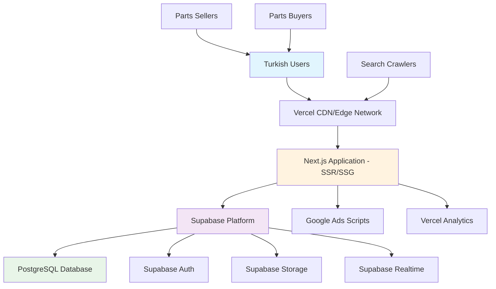
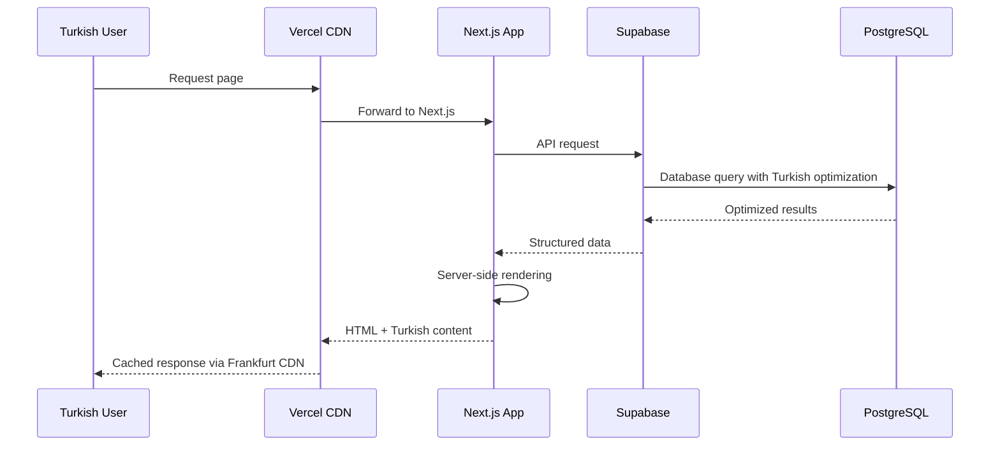
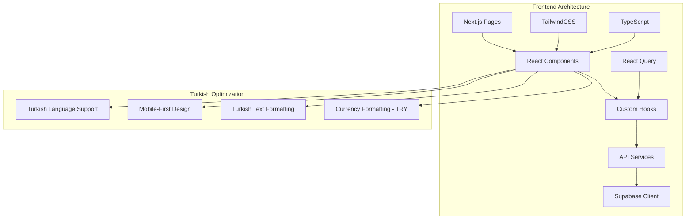
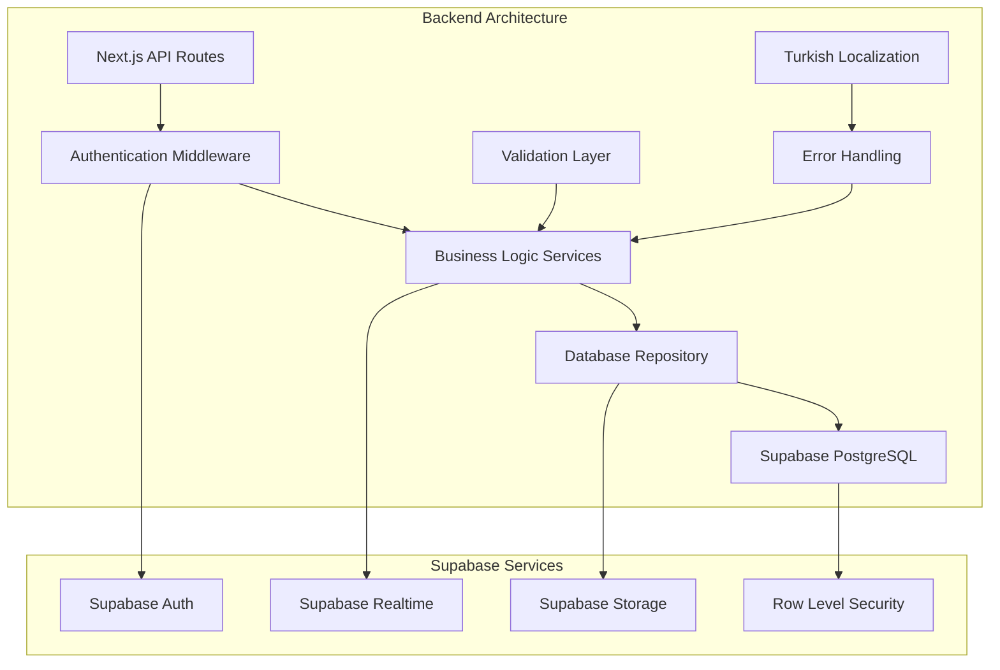
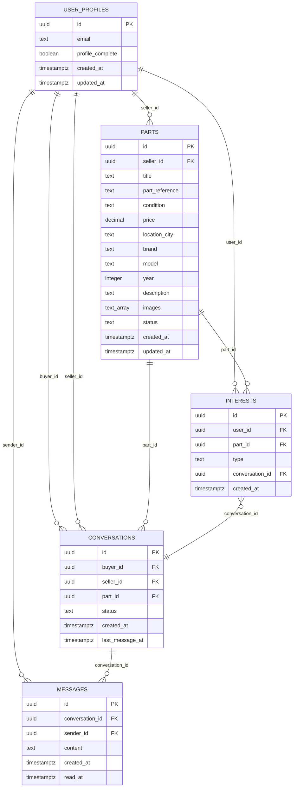
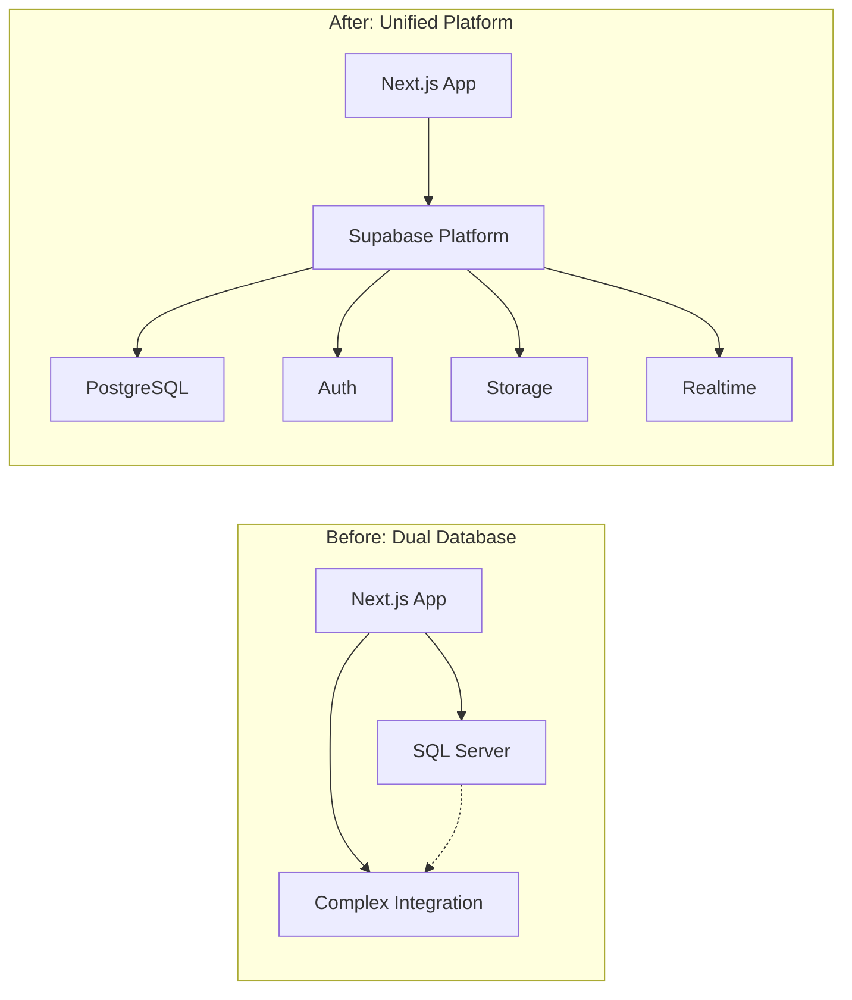

# System Overview - BanaYeni SanaEski Architecture

**Document Type:** High-Level System Architecture  
**Created:** August 6, 2025  
**Version:** 1.0  
**Status:** Architecture Complete  

---

## Architecture Summary

BanaYeni SanaEski employs a **Jamstack architecture** with server-side rendering via Next.js 13.4.12, backed by Supabase as a unified Backend-as-a-Service platform. The system is optimized for the Turkish automotive parts marketplace with focus on mobile-first design, Turkish text search capabilities, and interest-gated communication.

**Core Architectural Principles:**
- **Simplification First:** Migration from dual-database to unified Supabase platform
- **Turkish Market Optimization:** Performance and features tailored for Turkish users
- **Organic Growth Focus:** Architecture supporting Google Ads revenue model
- **Interest-Gated Communication:** Built-in spam prevention through explicit interest expression
- **Mobile-First Design:** Optimized for Turkish mobile network conditions

---

## Platform Architecture Decision

### Chosen Platform: Vercel + Supabase

**Rationale for Selection:**

| Factor | Vercel + Supabase | Alternative (AWS) | Alternative (DigitalOcean) |
|--------|------------------|-------------------|----------------------------|
| **Turkish CDN** | ✅ Frankfurt edge | ✅ Multiple regions | ⚠️ Limited regions |
| **Development Speed** | ✅ Zero-config | ⚠️ High complexity | ⚠️ Moderate setup |
| **Next.js Integration** | ✅ Native optimization | ⚠️ Manual configuration | ⚠️ Manual configuration |
| **Unified Backend** | ✅ Supabase all-in-one | ❌ Multiple services | ❌ Multiple services |
| **Cost Predictability** | ✅ Transparent pricing | ❌ Complex billing | ✅ Simple pricing |
| **Migration Simplicity** | ✅ Single platform | ❌ Complex setup | ⚠️ Moderate complexity |

**Selected Configuration:**
- **Frontend Hosting:** Vercel with global CDN
- **Backend Services:** Supabase (Auth, Database, Storage, Real-time)
- **CDN Optimization:** Frankfurt region priority for Turkish users
- **Database:** PostgreSQL via Supabase with Turkish text optimization

---

## High-Level System Architecture



### Component Interaction Flow



---

## Architectural Patterns

### Core Patterns Implementation

#### 1. Jamstack Architecture
**Implementation:** Static generation + serverless APIs + CDN delivery  
**Benefits:** Optimal SEO for Google Ads revenue, fast loading for Turkish mobile networks  
**Turkish Optimization:** Pre-rendered pages with Turkish content, optimized for search engines  

#### 2. Component-Based UI
**Implementation:** Reusable React components with TypeScript  
**Benefits:** Maintainability across marketplace features, type safety for Turkish text handling  
**Key Components:** PartCard, InterestButton, SearchForm, ConversationInterface  

#### 3. Repository Pattern
**Implementation:** Database abstraction layer for Supabase operations  
**Benefits:** Enables testing, supports migration from dual-database, centralizes business logic  
**Turkish Features:** Optimized queries for Turkish text search, part reference matching  

#### 4. Interest-Gate Pattern (Custom Business Logic)
**Implementation:** User engagement required before communication access  
**Benefits:** Reduces spam, increases qualified leads, improves marketplace dynamics  
**Business Rules:** Explicit interest → conversation creation → messaging access  

#### 5. Progressive Enhancement
**Implementation:** Core functionality works without JavaScript  
**Benefits:** Accessibility on varied Turkish devices, SEO optimization, performance reliability  
**Fallbacks:** Server-rendered search results, basic form submissions, static content  

---

## System Components Architecture

### Frontend Layer



**Key Frontend Components:**
- **SearchInterface:** Turkish-optimized parts search with filters
- **PartCard:** Part display with Turkish condition labels and price formatting  
- **InterestManagement:** Interest-gating UI with Turkish action buttons
- **ConversationInterface:** Async messaging with Turkish localization
- **PartsManagement:** Seller interface for part listing with image upload

### Backend Layer



**Key Backend Services:**
- **AuthenticationService:** Supabase Auth integration with user profile management
- **PartsRepository:** Turkish-optimized search, CRUD operations, business logic
- **InterestService:** Interest-gating logic, conversation creation, spam prevention  
- **ConversationEngine:** Real-time messaging, message persistence, access control
- **StorageService:** Image upload with Turkish mobile optimization

---

## Data Architecture

### Database Design Philosophy

**PostgreSQL via Supabase with Turkish Optimization:**
- **Text Search:** Trigram indexes for fuzzy Turkish text matching
- **Security:** Row-level security for user data protection
- **Performance:** Composite indexes for common search patterns
- **Scalability:** Connection pooling and query optimization

### Core Data Entities



### Turkish Text Search Optimization

```sql
-- Optimized search function for Turkish marketplace
CREATE OR REPLACE FUNCTION search_parts(
    search_query TEXT DEFAULT NULL,
    part_ref TEXT DEFAULT NULL,
    part_condition TEXT DEFAULT NULL,
    part_brand TEXT DEFAULT NULL,
    part_model TEXT DEFAULT NULL,
    part_city TEXT DEFAULT NULL,
    min_price DECIMAL DEFAULT NULL,
    max_price DECIMAL DEFAULT NULL,
    limit_count INTEGER DEFAULT 20,
    offset_count INTEGER DEFAULT 0
) RETURNS TABLE (
    -- Optimized return structure for API consumption
) AS $$
BEGIN
    RETURN QUERY
    SELECT p.id, p.seller_id, p.title, p.part_reference, p.condition, 
           p.price, p.location_city, p.brand, p.model, p.year, 
           p.description, p.images, p.created_at, p.status
    FROM public.parts p
    WHERE p.status = 'active'
        AND (search_query IS NULL OR 
             (p.title || ' ' || p.part_reference || ' ' || COALESCE(p.description, '')) 
             ILIKE '%' || search_query || '%')
        AND (part_ref IS NULL OR p.part_reference ILIKE '%' || part_ref || '%')
        AND (part_condition IS NULL OR p.condition = part_condition)
        AND (part_brand IS NULL OR p.brand ILIKE '%' || part_brand || '%')
        AND (part_model IS NULL OR p.model ILIKE '%' || part_model || '%')
        AND (part_city IS NULL OR p.location_city ILIKE '%' || part_city || '%')
        AND (min_price IS NULL OR p.price >= min_price)
        AND (max_price IS NULL OR p.price <= max_price)
    ORDER BY p.created_at DESC
    LIMIT limit_count
    OFFSET offset_count;
END;
$$ LANGUAGE plpgsql SECURITY DEFINER;
```

---

## Integration Architecture

### External Service Integrations

**Minimal Integration Strategy:**

| Service | Purpose | Integration Type | Turkish Optimization |
|---------|---------|------------------|---------------------|
| **Google Ads** | Revenue generation | Client-side scripts | Turkish keyword optimization |
| **Supabase Services** | Backend platform | Server-side SDK | Turkish region selection |
| **Vercel Analytics** | Performance monitoring | Built-in integration | Turkish user behavior tracking |

### API Architecture

**RESTful API Design with Turkish Optimization:**

```typescript
// API endpoint structure optimized for Turkish marketplace
interface ApiEndpoints {
  // Parts management
  'GET /api/parts': SearchPartsResponse;           // Turkish text search
  'POST /api/parts': CreatePartResponse;           // Turkish validation
  'GET /api/parts/[id]': PartDetailsResponse;     // Turkish content delivery
  
  // Interest management (core business logic)
  'POST /api/parts/[id]/interest': InterestResponse;  // Turkish confirmation messages
  'GET /api/interests': UserInterestsResponse;         // Turkish UI labels
  
  // Conversations (Turkish messaging)
  'GET /api/conversations': ConversationsResponse;     // Turkish conversation UI
  'GET /api/conversations/[id]/messages': MessagesResponse;  // Turkish message history
  'POST /api/conversations/[id]/messages': SendMessageResponse;  // Turkish message validation
}
```

---

## Performance Architecture

### Turkish Market Performance Targets

**Response Time Goals:**
- **Parts Search:** <300ms for Turkish text queries
- **Part Details:** <200ms for individual part loading
- **Interest Expression:** <500ms for business logic processing
- **Message Delivery:** <100ms for conversation updates

**Network Optimization:**
- **CDN Strategy:** Vercel edge network with Frankfurt priority
- **Image Delivery:** Supabase Storage with compression for Turkish mobile
- **Bundle Optimization:** <300KB initial bundle, <100KB per route
- **Caching Strategy:** Browser cache (1 year static), CDN cache (6 months images), API cache (5 minutes)

### Database Performance

```sql
-- Key indexes for Turkish marketplace performance
CREATE INDEX idx_parts_turkish_search ON public.parts USING GIN (
    to_tsvector('turkish', title || ' ' || part_reference || ' ' || COALESCE(description, ''))
);

CREATE INDEX idx_parts_brand_model_city ON public.parts (brand, model, location_city) 
WHERE status = 'active';

CREATE INDEX idx_parts_price_range ON public.parts (price) 
WHERE status = 'active';
```

---

## Security Architecture

### Multi-Layer Security Strategy

**Authentication & Authorization:**
- **Supabase Auth:** JWT-based authentication with Turkish email support
- **Row Level Security:** PostgreSQL RLS policies for data protection
- **API Security:** Middleware-based authentication for all protected routes
- **Session Management:** Secure cookie storage with Turkish timezone support

**Data Protection:**
```sql
-- Row Level Security policies for Turkish marketplace
CREATE POLICY "Users can view own profile" ON public.user_profiles
    FOR SELECT USING (auth.uid() = id);

CREATE POLICY "Anyone can view active parts" ON public.parts
    FOR SELECT USING (status = 'active');

CREATE POLICY "Participants can access conversation" ON public.conversations
    FOR ALL USING (auth.uid() = buyer_id OR auth.uid() = seller_id);
```

**Content Security:**
- **Input Validation:** Zod schemas with Turkish character support
- **XSS Prevention:** Content Security Policy + React escaping
- **Image Security:** Supabase Storage with access controls
- **Rate Limiting:** API protection against abuse

---

## Scalability Architecture

### Growth Planning

**Horizontal Scaling Strategy:**
- **Frontend:** Vercel automatic scaling with global edge deployment
- **Database:** Supabase managed scaling with connection pooling
- **Storage:** Supabase Storage with automatic CDN distribution
- **Real-time:** Supabase Realtime with managed WebSocket scaling

**Performance Monitoring:**
```typescript
// Key metrics for Turkish marketplace scaling
interface ScalingMetrics {
  searchLatency: number;           // <300ms target
  concurrentUsers: number;         // Turkish peak hours tracking
  databaseConnections: number;     // Connection pool utilization
  cdnCacheHitRate: number;        // Turkish content delivery efficiency
  mobilePerformance: number;      // Turkish mobile network optimization
}
```

---

## Migration Architecture

### Dual-Database to Supabase-Only

**Migration Benefits:**
- **Operational Simplification:** Single platform reduces maintenance overhead
- **Development Velocity:** Unified database context accelerates feature development
- **Cost Optimization:** Consolidated infrastructure reduces operational costs
- **Enhanced Capabilities:** Real-time features, better security, improved performance

**Architecture Evolution:**



---

## Future Architecture Considerations

### Phase 2 Enhancements (Months 4-6)
- **Real-time Messaging:** WebSocket upgrade for instant communication
- **Mobile App:** React Native app with shared API architecture
- **Advanced Search:** AI-powered part matching and recommendations
- **Seller Analytics:** Dashboard with performance metrics

### Phase 3 Scalability (Months 7-12)
- **Multi-region Deployment:** European expansion support
- **Microservices Evolution:** Service separation for specific domains
- **Advanced Caching:** Redis integration for high-performance caching
- **AI Integration:** Machine learning for part categorization and fraud detection

---

## Architectural Decision Records

### ADR-001: Platform Selection (Vercel + Supabase)
**Decision:** Use Vercel + Supabase instead of AWS or DigitalOcean  
**Rationale:** Developer productivity, Turkish CDN optimization, unified backend services  
**Trade-offs:** Vendor lock-in accepted for development velocity benefits  

### ADR-002: Database Unification Strategy
**Decision:** Migrate from dual-database to Supabase-only architecture  
**Rationale:** Operational simplification, reduced complexity, enhanced capabilities  
**Trade-offs:** Migration effort justified by long-term maintenance benefits  

### ADR-003: Messaging Architecture (Async First)
**Decision:** Start with async messaging, upgrade to real-time in Phase 2  
**Rationale:** MVP speed, lower complexity, user feedback-driven enhancement  
**Trade-offs:** Initial user experience trade-off for faster market validation  

### ADR-004: Turkish Text Search Optimization
**Decision:** Use PostgreSQL trigram indexes with Turkish language support  
**Rationale:** Native database performance better than external search service  
**Trade-offs:** Database complexity acceptable for performance benefits  

---

## Conclusion

The BanaYeni SanaEski system architecture successfully balances simplicity with functionality, providing a robust foundation for the Turkish automotive parts marketplace. The migration from dual-database to Supabase-only architecture eliminates operational complexity while enabling advanced features like real-time messaging and Turkish text optimization.

**Key Architectural Strengths:**
- **Unified Platform:** Supabase provides integrated backend services
- **Turkish Optimization:** Database, search, and UI optimized for Turkish market
- **Scalable Foundation:** Architecture supports organic growth and feature enhancement
- **Developer Productivity:** Simplified stack accelerates development and maintenance
- **Performance Focus:** CDN, caching, and database optimization for Turkish mobile users

This architecture positions BanaYeni SanaEski for sustainable growth while maintaining the flexibility to evolve based on user feedback and market conditions.

---

*This system overview serves as the foundational reference for all technical implementation decisions in the BanaYeni SanaEski project.*