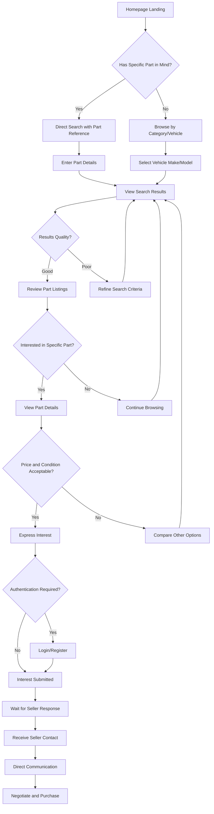
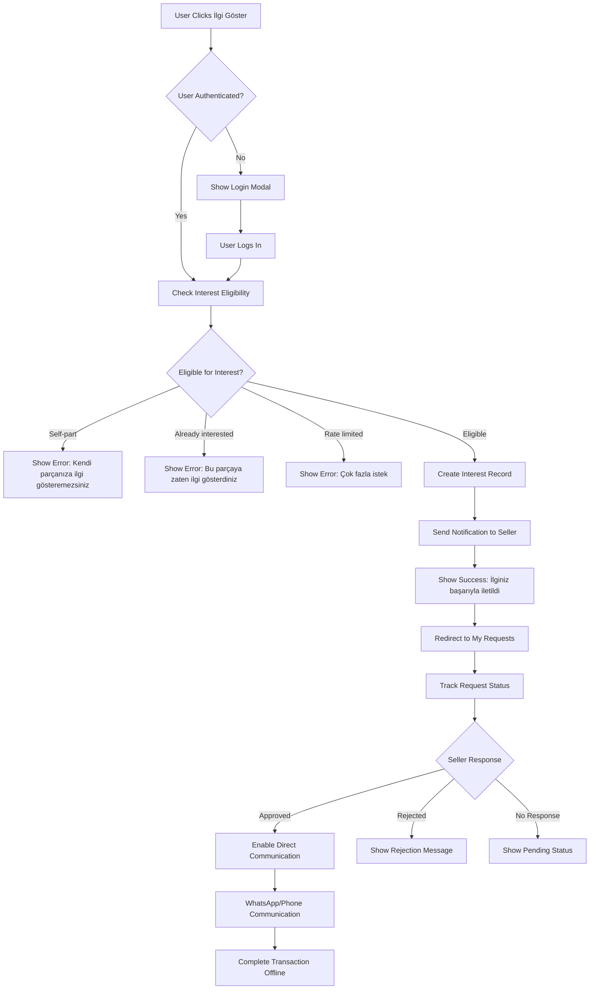
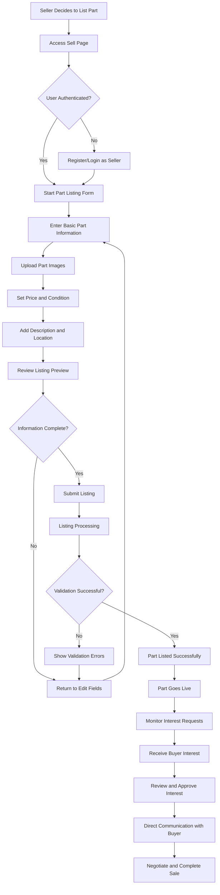

# User Workflows - BanaYeni SanaEski

**Document Type:** Complete User Journey and Workflow Documentation  
**Created:** August 6, 2025  
**Version:** 1.0  
**Status:** User Experience Definition  

---

## User Workflows Overview

This document defines all user workflows and journeys for BanaYeni SanaEski Turkish automotive parts marketplace, ensuring seamless user experiences that respect Turkish cultural patterns and business practices.

**User-Centric Design:** Turkish User Behavior and Cultural Preferences  
**Mobile-First Approach:** Optimized for Turkish Mobile Network Conditions  
**Business Logic Integration:** Interest-Gating and Turkish Commerce Rules  
**Accessibility Focus:** Inclusive Design for All Turkish Users  

---

## Primary User Personas

### User Persona Definitions

#### 1. Turkish Part Buyer (Parça Arayan)
```typescript
interface TurkishPartBuyer {
  demographics: {
    age: "25-55 years old";
    location: "Primarily Istanbul, Ankara, Izmir, other major Turkish cities";
    occupation: "Car owners, mechanics, automotive enthusiasts";
    income: "Middle class, price-conscious";
  };
  
  technicalProfile: {
    deviceUsage: "Primarily mobile (80%), tablet (15%), desktop (5%)";
    networkCondition: "3G/4G Turkish mobile networks";
    browserPreference: "Chrome mobile, Safari mobile";
    appUsage: "Prefer web apps over native apps";
  };
  
  behaviorPatterns: {
    searchFrequency: "2-3 times per month";
    decisionTime: "Quick decisions on common parts, research for expensive parts";
    priceComparison: "Always compare prices across platforms";
    communicationStyle: "Direct messaging, phone calls for complex parts";
  };
  
  painPoints: [
    "Finding genuine vs. aftermarket parts",
    "Unclear part compatibility",
    "Unreliable sellers",
    "High shipping costs within Turkey",
    "Language barriers with technical terms"
  ];
  
  goals: [
    "Find exact part match quickly",
    "Verify part authenticity and condition",
    "Compare prices effectively",
    "Connect with trustworthy sellers",
    "Complete purchase safely"
  ];
}
```

#### 2. Turkish Part Seller (Parça Satan)
```typescript
interface TurkishPartSeller {
  demographics: {
    age: "30-60 years old";
    location: "Auto scrapyards, mechanics, individual car owners";
    businessType: "Small business owners, individual sellers";
    experience: "Varying from novice to expert automotive knowledge";
  };
  
  technicalProfile: {
    deviceUsage: "Mobile (70%), desktop (30%)";
    timeAvailability: "Evening hours, weekends";
    photoCapability: "Basic smartphone photography";
    descriptionSkills: "Variable writing abilities";
  };
  
  businessGoals: [
    "Sell parts quickly at fair prices",
    "Reach serious buyers only",
    "Minimize time wasted on non-buyers",
    "Build reputation for repeat business",
    "Manage inventory efficiently"
  ];
  
  challenges: [
    "Writing effective part descriptions",
    "Taking quality photos",
    "Dealing with time-waster inquiries",
    "Pricing parts competitively",
    "Managing multiple interested buyers"
  ];
}
```

---

## Core User Workflows

### Workflow 1: Part Search and Discovery

#### 1.1 Turkish Part Buyer Search Journey


#### Detailed Search Workflow Steps

##### Step 1: Landing and Search Initiation
```typescript
interface SearchInitiationFlow {
  homepageOptions: {
    quickSearch: {
      placeholder: "Parça ara... (örn: BMW fren balata)";
      suggestions: "Real-time Turkish part suggestions";
      popularSearches: ["fren balata", "amortisör", "motor yağı", "lastik"];
    };
    
    categoryBrowsing: {
      categories: ["Motor Parçaları", "Fren Sistemi", "Elektrik", "Karoseri"];
      visualIcons: "Turkish automotive part category icons";
      mobileOptimized: true;
    };
    
    vehicleSelection: {
      makeSelection: ["BMW", "Mercedes", "Volkswagen", "Ford", "Renault"];
      modelAutocomplete: "Dynamic model loading based on make";
      yearRange: "2000-2024 (Turkish market focus)";
    };
  };
  
  searchBehavior: {
    mobileFirst: "Touch-optimized search interface";
    voiceSearch: "Turkish voice search support";
    cameraSearch: "Part photo recognition (future feature)";
    offlineCapability: "Basic search caching for Turkish networks";
  };
}
```

##### Step 2: Search Execution and Results
```typescript
interface SearchResultsFlow {
  searchExecution: {
    processTime: "< 200ms for Turkish text search";
    fallbackOptions: "Fuzzy search for misspellings";
    geographicRelevance: "Prioritize parts in same Turkish city";
    mobilePagination: "Infinite scroll for mobile users";
  };
  
  resultsPresentation: {
    listView: {
      partImage: "Thumbnail with lazy loading";
      partTitle: "Clear, descriptive Turkish title";
      partReference: "Prominent part reference number";
      price: "Turkish Lira formatting (1.500 TL)";
      location: "Turkish city name";
      condition: "Kullanılabilir/Arızalı status";
      seller: "Seller rating and verification status";
    };
    
    filterOptions: {
      price: "Min-max Turkish Lira range";
      location: "Turkish city dropdown";
      condition: "Kullanılabilir/Arızalı";
      brand: "Automotive brand selection";
      distance: "Proximity-based filtering";
    };
    
    sortingOptions: [
      "En Yakın (distance)",
      "En Ucuz (price low to high)",
      "En Yeni (newest first)",
      "En Çok Beğenilen (most liked)"
    ];
  };
}
```

##### Step 3: Part Detail Examination
```typescript
interface PartDetailFlow {
  detailPageStructure: {
    imageGallery: {
      primaryImage: "High-quality main part image";
      additionalImages: "Swipeable gallery (mobile-optimized)";
      zoomFunctionality: "Pinch-to-zoom on mobile";
      imageLoading: "Progressive loading for Turkish networks";
    };
    
    partInformation: {
      title: "Full part description in Turkish";
      partReference: "Clearly displayed part reference number";
      compatibility: "Compatible vehicle models";
      condition: "Detailed condition description";
      price: "Prominent Turkish Lira pricing";
      location: "Seller location with map option";
      availabilityStatus: "Real-time availability indicator";
    };
    
    sellerInformation: {
      sellerName: "Verified seller name/business";
      rating: "Star rating with review count";
      responseTime: "Average response time";
      activeListings: "Other parts from same seller";
      verificationBadges: "Identity and business verification";
    };
  };
  
  actionOptions: {
    primaryAction: {
      interestButton: "İlgi Göster - primary CTA";
      requiresAuth: "Login modal for guest users";
      spamPrevention: "Interest-gating implementation";
      feedbackMessage: "İlginiz başarıyla iletildi";
    };
    
    secondaryActions: {
      favoritePart: "Add to favorites for later";
      sharePart: "Share via Turkish social platforms";
      reportPart: "Report inappropriate listing";
      viewSimilar: "Similar parts recommendation";
    };
  };
}
```

### Workflow 2: Interest Expression and Communication

#### 2.1 Interest-Gating System Flow


#### Detailed Interest Expression Flow

##### Step 1: Interest Validation
```typescript
interface InterestValidationFlow {
  preValidation: {
    userAuthentication: {
      guestDetection: "Immediate login modal for guests";
      sessionValidation: "Check for valid user session";
      redirectAfterLogin: "Return to part page after authentication";
    };
    
    eligibilityChecks: [
      {
        check: "selfPartValidation";
        condition: "user_id !== seller_id";
        error: "Kendi parçanıza ilgi gösteremezsiniz";
      },
      {
        check: "duplicateInterestValidation";
        condition: "no existing interest from this user";
        error: "Bu parçaya zaten ilgi göstermişsiniz";
      },
      {
        check: "rateLimitValidation";
        condition: "user interest count < daily limit";
        error: "Günlük ilgi sınırını aştınız";
      },
      {
        check: "partAvailabilityValidation";
        condition: "part is still available";
        error: "Bu parça artık satışta değil";
      }
    ];
  };
  
  interestCreation: {
    dataCollection: {
      userId: "Authenticated user identifier";
      partId: "Target part identifier";
      timestamp: "Turkish timezone timestamp";
      sourceTracking: "How user found the part";
      deviceInfo: "Mobile/desktop tracking for analytics";
    };
    
    businessLogicExecution: {
      interestRecordCreation: "Create interest in database";
      notificationTrigger: "Queue seller notification";
      analyticsTracking: "Track interest conversion metrics";
      rateLimitUpdate: "Update user's daily interest count";
    };
  };
}
```

##### Step 2: Seller Notification System
```typescript
interface SellerNotificationFlow {
  immediateNotification: {
    inAppNotification: {
      title: "Parçanıza yeni ilgi!";
      message: "BMW fren balata parçanıza {{userName}} ilgi gösterdi";
      actionButton: "Görüntüle";
      timestamp: "Turkish timezone display";
    };
    
    emailNotification: {
      subject: "BanaYeni SanaEski - Parçanıza Yeni İlgi";
      template: "Turkish email template with part details";
      cta: "İlgiyi Görüntüle ve Yanıtla";
      frequency: "Immediate for first interest, batched for multiple";
    };
    
    smsNotification: {
      message: "Parçanıza yeni ilgi var! banayeni.com'dan kontrol edin";
      sender: "BanaYeni";
      optOut: "User preference based";
    };
  };
  
  notificationManagement: {
    consolidation: "Multiple interests grouped in single notification";
    frequency: "Configurable notification frequency";
    quietHours: "Respect Turkish evening/night hours";
    preferences: "User-controlled notification settings";
  };
}
```

##### Step 3: Communication Facilitation
```typescript
interface CommunicationFlow {
  approvalProcess: {
    sellerDashboard: {
      interestList: "List of pending interests";
      buyerInformation: "Basic buyer profile and verification";
      partContext: "Which part and interest message";
      actionOptions: ["Onayla", "Reddet", "Daha Sonra"];
    };
    
    approvalActions: {
      approve: {
        action: "Enable direct communication";
        notification: "Send contact details to buyer";
        tracking: "Mark as approved in analytics";
      };
      reject: {
        action: "Send polite rejection message";
        reason: "Optional rejection reason";
        tracking: "Track rejection patterns";
      };
      defer: {
        action: "Keep as pending";
        reminder: "Remind seller after 24 hours";
      };
    };
  };
  
  directCommunication: {
    contactSharing: {
      sellerTobuyer: "Share seller's WhatsApp/phone";
      buyerProtection: "Seller contact only after approval";
      platformTracking: "Track communication handoff";
    };
    
    communicationChannels: {
      whatsapp: "Primary Turkish communication preference";
      phone: "Direct calling for complex negotiations";
      inAppMessage: "Basic messaging for simple questions";
    };
  };
}
```

### Workflow 3: Part Listing and Selling

#### 3.1 Turkish Part Seller Listing Journey


#### Detailed Listing Workflow

##### Step 1: Seller Onboarding and Verification
```typescript
interface SellerOnboardingFlow {
  registrationProcess: {
    accountCreation: {
      personalInfo: {
        fullName: "Turkish name validation";
        phoneNumber: "Turkish mobile format (+90 5XX XXX XXXX)";
        email: "Standard email validation";
        idVerification: "Optional Turkish ID verification";
      };
      
      businessInfo: {
        businessType: ["Bireysel Satıcı", "Oto Galeri", "Yedek Parça Satıcısı"];
        businessName: "Optional business name";
        taxNumber: "Optional Turkish tax number";
        businessAddress: "Business location for verification";
      };
    };
    
    verificationSteps: {
      phoneVerification: "SMS OTP to Turkish mobile number";
      emailVerification: "Email confirmation link";
      identityVerification: "Optional photo ID upload";
      businessVerification: "Business license upload (for businesses)";
    };
  };
  
  sellerProfile: {
    profileCompletion: {
      profilePhoto: "Seller/business photo upload";
      description: "Seller bio and expertise";
      specialization: "automotive specialization areas";
      workingHours: "Turkish business hours";
      responseTime: "Expected response time commitment";
    };
    
    trustIndicators: {
      verificationBadges: "Phone, email, ID verification badges";
      rating: "Initial rating based on profile completeness";
      responseRate: "Tracked over time";
      listingQuality: "AI-assessed listing quality score";
    };
  };
}
```

##### Step 2: Part Information Collection
```typescript
interface PartListingFlow {
  basicInformation: {
    partTitle: {
      validation: "5-100 characters, Turkish text support";
      suggestions: "Auto-suggestions based on part reference";
      examples: ["BMW E90 Ön Fren Balata", "Mercedes W204 Amortisör"];
      turkishCharacterSupport: true;
    };
    
    partReference: {
      validation: "3-20 alphanumeric characters";
      format: "OEM part number format";
      verification: "Optional part reference verification";
      examples: ["A2048800440", "34116855152"];
    };
    
    vehicleCompatibility: {
      make: "Automotive brand dropdown";
      model: "Dynamic model loading";
      yearRange: "2000-2024 year selection";
      engineType: "Optional engine specification";
    };
    
    condition: {
      options: ["Kullanılabilir", "Arızalı"];
      conditionDescription: "Detailed condition explanation";
      defectDescription: "Required for 'Arızalı' items";
    };
  };
  
  visualDocumentation: {
    imageUpload: {
      requirements: {
        minImages: 1;
        maxImages: 8;
        formats: ["JPEG", "PNG", "WebP"];
        maxSize: "2MB per image";
        dimensions: "Min 640x640 pixels";
      };
      
      mobileOptimization: {
        cameraCapture: "Direct camera capture on mobile";
        imageCompression: "Auto-compression for Turkish networks";
        uploadProgress: "Progress indicator for slow connections";
        retryMechanism: "Auto-retry failed uploads";
      };
      
      qualityGuidance: {
        tips: "Resim çekme ipuçları";
        examples: "Good vs. poor photo examples";
        lighting: "Natural light recommendations";
        angles: "Multiple angle suggestions";
      };
    };
  };
  
  pricingAndLocation: {
    pricing: {
      currency: "Turkish Lira (TRY) only";
      validation: "1-1,000,000 TL range";
      suggestions: "Market price suggestions based on similar parts";
      negotiability: "Fixed price vs. negotiable";
    };
    
    locationDetails: {
      city: "Turkish city dropdown (81 provinces)";
      district: "District selection within city";
      deliveryOptions: {
        pickup: "Pickup from seller location";
        shipping: "Shipping within Turkey";
        meetup: "Meet at agreed location";
      };
    };
  };
}
```

##### Step 3: Listing Publication and Management
```typescript
interface ListingPublicationFlow {
  prePublicationReview: {
    listingPreview: {
      mobilePreview: "How listing appears on mobile";
      desktopPreview: "Desktop listing appearance";
      seoPreview: "Search result preview";
      socialPreview: "Social sharing preview";
    };
    
    qualityChecks: {
      imageQuality: "Automated image quality assessment";
      textQuality: "Turkish text grammar and completeness";
      priceReasonableness: "Price comparison with similar items";
      completeness: "All required fields completion check";
    };
  };
  
  publicationProcess: {
    immediatePublication: {
      listingActivation: "Immediate listing activation";
      searchIndexing: "Add to Turkish search index";
      notificationTrigger: "Notify interested buyers";
      analyticsTracking: "Track listing performance";
    };
    
    sellerNotification: {
      confirmationEmail: "Listing published confirmation";
      managementLink: "Direct link to manage listing";
      performanceTips: "Tips for better listing performance";
      supportContact: "Customer support information";
    };
  };
  
  listingManagement: {
    sellerDashboard: {
      listingStatus: "Active, paused, sold status management";
      viewAnalytics: "Views, interests, conversion metrics";
      editListing: "Update price, description, availability";
      renewListing: "Boost listing visibility";
    };
    
    interestManagement: {
      interestList: "List of buyer interests";
      buyerProfiles: "Basic buyer information";
      responseTracking: "Response time tracking";
      communicationHistory: "Interest approval history";
    };
  };
}
```

### Workflow 4: User Account Management

#### 4.1 Account Registration and Login Flow
```typescript
interface UserAccountFlow {
  registrationOptions: {
    emailRegistration: {
      emailValidation: "Standard email format validation";
      passwordRequirements: "8+ chars, mixed case, numbers";
      confirmationEmail: "Email verification required";
      turkishLanguageSupport: "Registration form in Turkish";
    };
    
    socialLogin: {
      googleLogin: "Google account integration";
      facebookLogin: "Facebook account integration (popular in Turkey)";
      appleLogin: "Apple Sign-In for iOS users";
      dataImport: "Import basic profile from social accounts";
    };
    
    phoneRegistration: {
      phoneValidation: "Turkish mobile number format";
      otpVerification: "SMS OTP verification";
      alternativeLogin: "Phone-based login option";
    };
  };
  
  loginProcess: {
    multipleOptions: {
      emailLogin: "Email and password";
      phoneLogin: "Phone number and OTP";
      socialLogin: "Continue with Google/Facebook";
      biometricLogin: "Fingerprint/Face ID on mobile";
    };
    
    securityFeatures: {
      rememberDevice: "30-day device remembering";
      twoFactorAuth: "Optional 2FA for security-conscious users";
      sessionManagement: "Automatic logout after 30 days";
      suspiciousActivity: "Login anomaly detection";
    };
  };
  
  profileManagement: {
    basicProfile: {
      personalInformation: "Name, phone, email, location";
      profilePicture: "Optional profile photo upload";
      preferences: "Language, currency, notification preferences";
      privacy: "Profile visibility settings";
    };
    
    sellerProfile: {
      businessInformation: "Business type and details";
      verificationStatus: "Phone, email, ID verification";
      sellingPreferences: "Default listing preferences";
      responseTime: "Target response time for inquiries";
    };
    
    buyerProfile: {
      vehicleInformation: "Owned vehicles for personalized search";
      searchPreferences: "Saved search criteria";
      favoriteCategories: "Preferred part categories";
      locationPreferences: "Preferred buying locations";
    };
  };
}
```

### Workflow 5: Search and Discovery Optimization

#### 5.1 Advanced Search Behaviors
```typescript
interface SearchOptimizationFlow {
  searchMethods: {
    textSearch: {
      autoComplete: "Real-time Turkish part suggestions";
      spellCorrection: "Turkish text spell correction";
      synonymHandling: "Handle automotive terminology variations";
      characterNormalization: "Turkish character normalization (ç→c)";
    };
    
    visualSearch: {
      photoSearch: "Upload part photo for identification (future)";
      barcodeScanning: "Scan part barcodes (future)";
      vinDecoding: "Vehicle VIN number decoding (future)";
    };
    
    voiceSearch: {
      turkishVoiceRecognition: "Turkish language voice search";
      technicalTerms: "Automotive terminology recognition";
      mobileOptimization: "Mobile voice search optimization";
    };
  };
  
  searchPersonalization: {
    userHistory: {
      searchHistory: "Previous search queries";
      viewedParts: "Recently viewed parts";
      interestedParts: "Parts user showed interest in";
      purchaseHistory: "Past purchase patterns";
    };
    
    recommendations: {
      similarParts: "Parts similar to user interests";
      complementaryParts: "Related automotive parts";
      locationBased: "Parts available in user's city";
      priceRange: "Parts in user's typical price range";
    };
  };
  
  searchAnalytics: {
    queryTracking: {
      popularSearches: "Most common search terms";
      noResultQueries: "Searches with no results";
      abandonedSearches: "Searches without engagement";
      conversionTracking: "Search to interest conversion";
    };
    
    performanceMetrics: {
      searchSpeed: "Query response times";
      resultRelevance: "User engagement with results";
      filterUsage: "Most used search filters";
      mobilePerformance: "Mobile search performance";
    };
  };
}
```

---

## Mobile-Specific User Workflows

### Mobile User Experience Optimization

#### Mobile Navigation Patterns
```typescript
interface MobileWorkflowOptimization {
  navigationPatterns: {
    bottomNavigation: {
      primaryTabs: ["Ana Sayfa", "Ara", "Sat", "Hesabım"];
      iconDesign: "Touch-friendly icons (min 44px)";
      badgeNotifications: "New interest notifications";
      quickActions: "Long-press for quick actions";
    };
    
    gestureNavigation: {
      swipeGestures: "Swipe between images in part details";
      pullToRefresh: "Pull down to refresh search results";
      infiniteScroll: "Automatic loading of more results";
      backGesture: "Native back gesture support";
    };
  };
  
  mobileFormOptimization: {
    inputOptimization: {
      virtualKeyboard: "Appropriate keyboard types";
      autoFill: "Support for Turkish address autofill";
      inputValidation: "Real-time validation feedback";
      errorHandling: "Clear error messages in Turkish";
    };
    
    imageHandling: {
      cameraIntegration: "Direct camera capture";
      gallerySelection: "Multiple image selection";
      cropAndRotate: "Basic image editing";
      compressionPreview: "Show compressed image preview";
    };
  };
  
  performanceOptimization: {
    loadingStates: {
      skeletonScreens: "Content placeholder loading";
      progressIndicators: "Upload and search progress";
      offlineHandling: "Offline state messaging";
      retryMechanisms: "Automatic retry for failed requests";
    };
    
    networkOptimization: {
      imageCompression: "Automatic image compression";
      lazyLoading: "Load images as needed";
      caching: "Cache frequently accessed data";
      backgroundSync: "Sync data when network available";
    };
  };
}
```

---

## Accessibility and Inclusive Design

### Turkish Accessibility Standards

#### Accessibility Workflow Integration
```typescript
interface AccessibilityWorkflow {
  visualAccessibility: {
    colorContrast: {
      minimumContrast: "WCAG AA compliance (4.5:1)";
      colorBlindness: "Support for color vision deficiency";
      highContrast: "High contrast mode option";
      darkMode: "Dark theme for low-light usage";
    };
    
    textScaling: {
      dynamicText: "Support iOS and Android text scaling";
      minimumSize: "16px minimum for Turkish text";
      lineHeight: "1.5 line height for readability";
      fontChoice: "Turkish character optimized fonts";
    };
  };
  
  motorAccessibility: {
    touchTargets: {
      minimumSize: "44px minimum touch targets";
      spacing: "8px minimum spacing between targets";
      gestureAlternatives: "Button alternatives to gestures";
      oneHandedUse: "Thumb-friendly navigation";
    };
    
    navigationAids: {
      skipLinks: "Skip to main content links";
      focusIndicators: "Clear focus indicators";
      tabOrder: "Logical tab navigation order";
      keyboardShortcuts: "Keyboard navigation support";
    };
  };
  
  cognitiveAccessibility: {
    simplicity: {
      clearLanguage: "Simple, clear Turkish language";
      consistentLayout: "Predictable interface patterns";
      errorPrevention: "Prevent common user errors";
      undoOptions: "Undo capabilities for actions";
    };
    
    guidance: {
      progressIndicators: "Show process completion";
      helpText: "Contextual help in Turkish";
      examples: "Input format examples";
      confirmations: "Confirm important actions";
    };
  };
}
```

---

## Error Recovery Workflows

### User Error Handling and Recovery

#### Error Recovery Patterns
```typescript
interface ErrorRecoveryWorkflow {
  networkErrors: {
    detectionAndFeedback: {
      offlineDetection: "Detect network connectivity loss";
      userNotification: "İnternet bağlantısı kesildi";
      offlineCapabilities: "Show cached content when offline";
      reconnectionDetection: "Auto-retry when connection restored";
    };
    
    recoveryActions: {
      manualRetry: "Tekrar Dene button";
      automaticRetry: "Background retry with exponential backoff";
      offlineQueue: "Queue actions to perform when online";
      dataSync: "Sync changes when connection restored";
    };
  };
  
  inputErrors: {
    validationErrors: {
      realTimeValidation: "Validate as user types";
      clearErrorMessages: "Specific error messages in Turkish";
      fieldHighlighting: "Highlight problematic fields";
      successFeedback: "Show when validation passes";
    };
    
    recoveryGuidance: {
      correctionSuggestions: "Suggest corrections for common errors";
      formatExamples: "Show correct format examples";
      autoCorrection: "Auto-correct common mistakes";
      undoCapability: "Undo incorrect changes";
    };
  };
  
  systemErrors: {
    gracefulDegradation: {
      partialFunctionality: "Maintain core functionality during errors";
      fallbackOptions: "Alternative ways to complete tasks";
      statusCommunication: "Clear communication about system status";
      expectedResolution: "When service expected to be restored";
    };
  };
}
```

---

## Performance and Analytics Workflows

### User Experience Monitoring

#### Analytics and Optimization Flow
```typescript
interface UserAnalyticsWorkflow {
  userBehaviorTracking: {
    journeyAnalytics: {
      pageViews: "Track page navigation patterns";
      searchBehavior: "Search terms and result interactions";
      conversionFunnels: "Track interest to purchase conversion";
      dropOffPoints: "Identify where users abandon tasks";
    };
    
    performanceMetrics: {
      loadTimes: "Page and component load times";
      networkPerformance: "Performance on Turkish networks";
      errorRates: "Error frequency and types";
      userSatisfaction: "In-app feedback and ratings";
    };
  };
  
  turkishMarketInsights: {
    culturalMetrics: {
      preferredCommunication: "WhatsApp vs. phone vs. email usage";
      searchPatterns: "Turkish-specific search behaviors";
      mobileUsage: "Mobile vs. desktop usage patterns";
      timeOfDay: "Peak usage times in Turkish timezone";
    };
    
    businessMetrics: {
      listingSuccess: "Part listing to sale conversion";
      interestQuality: "Interest to communication conversion";
      geographicPerformance: "Performance by Turkish city";
      categoryPopularity: "Most popular part categories";
    };
  };
  
  continuousOptimization: {
    abTesting: {
      userInterface: "Test different UI approaches";
      copyTesting: "Test different Turkish messaging";
      priceDisplay: "Test price formatting preferences";
      buttonPlacement: "Test call-to-action positioning";
    };
    
    personalization: {
      contentCustomization: "Personalize based on user behavior";
      searchRanking: "Personalized search result ranking";
      recommendationEngine: "Recommend relevant parts";
      notificationOptimization: "Optimize notification timing";
    };
  };
}
```

---

## Cross-Platform Consistency

### Multi-Device User Experience

#### Device-Agnostic Workflow Design
```typescript
interface CrossPlatformWorkflow {
  deviceSynchronization: {
    accountSync: {
      profileData: "Sync profile across devices";
      searchHistory: "Sync search history and preferences";
      favorites: "Sync saved parts and searches";
      notifications: "Consistent notifications across devices";
    };
    
    progressContinuation: {
      draftListings: "Save listing drafts across devices";
      searchState: "Continue searches on different devices";
      conversationHistory: "Access conversations from any device";
      cartState: "Maintain interest state across devices";
    };
  };
  
  responsiveDesign: {
    adaptiveLayouts: {
      mobileFirst: "Mobile-optimized primary design";
      tabletAdaptation: "Tablet-specific layout adjustments";
      desktopEnhancement: "Enhanced desktop experience";
      touchOptimization: "Touch-friendly controls on all devices";
    };
    
    contentPriority: {
      mobilePriority: "Prioritize essential content on mobile";
      progressiveDisclosure: "Show more details on larger screens";
      contextualActions: "Device-appropriate action placement";
      informationDensity: "Adjust information density by screen size";
    };
  };
}
```

---

## Conclusion

This comprehensive User Workflows documentation ensures that BanaYeni SanaEski delivers exceptional user experiences tailored specifically for the Turkish automotive parts marketplace. The workflows encompass:

**Complete User Journey Coverage:**
- **Buyer Workflows:** From search to interest expression to communication
- **Seller Workflows:** From listing creation to interest management to sales completion
- **Account Management:** Registration, authentication, and profile management
- **Mobile Optimization:** Turkish mobile network and device optimization

**Turkish Market Integration:**
- **Cultural Appropriateness:** Workflows respect Turkish communication and commerce patterns
- **Language Optimization:** All user interactions in clear, helpful Turkish
- **Local Business Rules:** Interest-gating and Turkish commerce practice integration
- **Geographic Relevance:** Location-based features and Turkish city optimization

**Accessibility and Performance:**
- **Inclusive Design:** WCAG compliance with Turkish language considerations
- **Mobile-First:** Optimized for primary Turkish mobile usage patterns
- **Network Optimization:** Designed for Turkish mobile network conditions
- **Error Recovery:** Comprehensive error handling with clear Turkish guidance

**Continuous Optimization:**
- **Analytics Integration:** Comprehensive tracking of Turkish user behaviors
- **Performance Monitoring:** Real-time optimization for Turkish users
- **A/B Testing:** Continuous improvement through data-driven decisions
- **Cross-Platform Consistency:** Seamless experience across all devices

These user workflows position BanaYeni SanaEski to deliver world-class user experiences that feel natural and intuitive to Turkish automotive parts marketplace users, driving engagement, conversion, and long-term platform success.

---

*This User Workflows documentation serves as the complete guide for understanding and optimizing all user interactions within the BanaYeni SanaEski marketplace platform.*